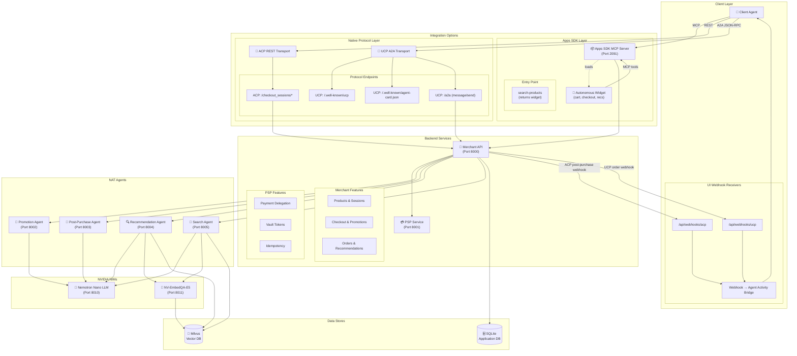

# NVIDIA AI Blueprint: Retail Agentic Commerce

[](LICENSE)
[](https://www.python.org/downloads/)
[](https://nodejs.org/)

<div align="center">


</div>

A reference implementation of the Agentic Commerce Protocol (ACP) and Universal Commerce Protocol (UCP), built for merchant-controlled checkout, payments, and agent orchestration.

## Architecture


## What You Get

- Merchant API (ACP + UCP discovery/A2A)
- PSP service for delegated payment flows
- Apps SDK MCP server + widget
- NAT agents for promotion, recommendations, search, and post-purchase messaging
- Demo UI with protocol and agent activity panels

## Architecture (Default Deployment)



## Quick Start (Docker, Public Endpoints)

This is the recommended path. It does not require local NIM containers.

### Prerequisites

- Docker 24+
- Docker Compose v2
- NVIDIA API key ([create one](https://build.nvidia.com/settings/api-keys))

### 1. Clone and Configure

```bash
git clone https://github.com/NVIDIA/Retail-Agentic-Commerce.git
cd Retail-Agentic-Commerce
cp env.example .env
```

Update `.env`:

```env
NVIDIA_API_KEY=nvapi-xxx
```

The defaults already use public NVIDIA endpoints:

```env
NIM_LLM_BASE_URL=https://integrate.api.nvidia.com/v1
NIM_EMBED_BASE_URL=https://integrate.api.nvidia.com/v1
```

### 2. Create Shared Docker Network (one-time)

```bash
docker network create acp-infra-network || true
```

### Quick Start (Codex/Cursor/Claude)

```bash
git clone https://github.com/NVIDIA-AI-Blueprints/Retail-Agentic-Commerce.git
cd Retail-Agentic-Commerce
codex
```

Then run `setup`. In Cursor or Claude Code, open the repo and run `setup` in the agent chat.

### 3. Start Infrastructure + App Stack

```bash
docker compose -f docker-compose.infra.yml -f docker-compose.yml up --build -d
```

### 4. Verify Health

```bash
curl http://localhost/api/health
curl http://localhost/psp/health
curl http://localhost/apps-sdk/health
```

Agent services also expose `/health`, but in full Docker deployment they are internal-only (not published on `localhost`).

### 5. Open the Application

- Demo UI: http://localhost
- Phoenix traces: http://localhost:6006
- MinIO console: http://localhost:9001

## Service Routes

| Route | Service | Purpose |
|---|---|---|
| `/` | UI | Demo frontend |
| `/api/*` | Merchant API | ACP/UCP, products, checkout, orders |
| `/psp/*` | PSP | Delegated payment endpoints |
| `/apps-sdk/*` | Apps SDK MCP | MCP server + widget assets |

## Common Operations

### Logs and Status

```bash
docker compose -f docker-compose.infra.yml -f docker-compose.yml ps
docker compose -f docker-compose.infra.yml -f docker-compose.yml logs -f merchant
docker compose -f docker-compose.infra.yml -f docker-compose.yml logs -f nginx
```

### Agent Health (Troubleshooting)

Docker deployment (check from inside the merchant container):

```bash
docker compose -f docker-compose.infra.yml -f docker-compose.yml exec merchant \
  python -c "import urllib.request as u; print('promotion', u.urlopen('http://promotion-agent:8002/health', timeout=5).status); print('post-purchase', u.urlopen('http://post-purchase-agent:8003/health', timeout=5).status); print('recommendation', u.urlopen('http://recommendation-agent:8004/health', timeout=5).status); print('search', u.urlopen('http://search-agent:8005/health', timeout=5).status)"
```

Local development (agents started on host ports):

```bash
curl http://localhost:8002/health
curl http://localhost:8003/health
curl http://localhost:8004/health
curl http://localhost:8005/health
```

### Stop Services

```bash
# Stop app + infra containers
docker compose -f docker-compose.infra.yml -f docker-compose.yml down

# Stop and remove volumes (full reset)
docker compose -f docker-compose.infra.yml -f docker-compose.yml down -v
```

### Rebuild

```bash
docker compose -f docker-compose.infra.yml -f docker-compose.yml build
docker compose -f docker-compose.infra.yml -f docker-compose.yml up -d
```

## Local Development (Optional)

Use this when you want faster iteration outside full Docker runtime.

### 1. Start Infra in Docker

```bash
docker network create acp-infra-network || true
docker compose -f docker-compose.infra.yml up -d
```

### 2. Run Backend Services

Run each service in a separate terminal:

```bash
# Terminal 1
uv venv
source .venv/bin/activate
uv sync
uvicorn src.merchant.main:app --reload
```

```bash
# Terminal 2
source .venv/bin/activate
uvicorn src.payment.main:app --reload --port 8001
```

```bash
# Terminal 3
source .venv/bin/activate
uvicorn src.apps_sdk.main:app --reload --port 2091
```

### 3. Run NAT Agents

Run each agent in a separate terminal:

```bash
# Setup once
cd src/agents
uv venv
source .venv/bin/activate
uv pip install -e ".[dev]"
```

```bash
# Terminal 4
cd src/agents
source .venv/bin/activate
nat serve --config_file configs/promotion.yml --port 8002
```

```bash
# Terminal 5
cd src/agents
source .venv/bin/activate
nat serve --config_file configs/post-purchase.yml --port 8003
```

```bash
# Terminal 6
cd src/agents
source .venv/bin/activate
nat serve --config_file configs/recommendation.yml --port 8004
```

```bash
# Terminal 7
cd src/agents
source .venv/bin/activate
nat serve --config_file configs/search.yml --port 8005
```

### 4. Run UI

```bash
cd src/ui
cp env.example .env.local
pnpm install
pnpm dev
```

Optional Apps SDK widget dev server:

```bash
cd src/apps_sdk/web
pnpm install
pnpm dev
```

## Hardware Requirements (Local NIM Deployment)

Local NIM deployment requires NVIDIA GPUs to host the inference models. The following table summarizes the models and their GPU requirements:

| Model | Purpose | Minimum GPU | Recommended GPU |
|-------|---------|-------------|-----------------|
| [Nemotron-Nano-30B-A3B](https://build.nvidia.com/nvidia/nemotron-3-nano-30b-a3b) | LLM — prompt planning, recommendations, search, promotions | 1× A100 (80 GB) | 1× H100 (80 GB) |
| [NV-EmbedQA-E5-v5](https://build.nvidia.com/nvidia/nv-embedqa-e5-v5) | Embedding — semantic search and product retrieval | 1× A100 (80 GB) | 1× H100 (80 GB) |

**Total:** 2× A100 (80 GB) minimum, 2× H100 (80 GB) recommended for best performance.

> **Note:** These requirements apply only to self-hosted local NIM deployment. The default deployment uses public NVIDIA API endpoints and does not require any GPU hardware.

## Optional: Local NIM Deployment (GPU)

Only needed for self-hosted local inference. The default deployment already works with public endpoints.

### 1. Start Local NIMs

```bash
docker compose -f docker-compose-nim.yml up -d
```

### 2. Point Agents to Local NIM in `.env`

```env
NIM_LLM_BASE_URL=http://nemotron-nano:8000/v1
NIM_LLM_MODEL_NAME=nvidia/nemotron-3-nano
NIM_EMBED_BASE_URL=http://embedqa:8000/v1
NIM_EMBED_MODEL_NAME=nvidia/nv-embedqa-e5-v5
```

### 3. Start Full Stack with NIM + Infra + App

```bash
docker compose -f docker-compose.infra.yml -f docker-compose-nim.yml -f docker-compose.yml up --build -d
```

## API Docs

Docker (via nginx):

- Merchant API health: http://localhost/api/health
- PSP health: http://localhost/psp/health
- Apps SDK MCP health: http://localhost/apps-sdk/health
- Merchant OpenAPI: http://localhost/api/openapi.json
- PSP OpenAPI: http://localhost/psp/openapi.json
- Apps SDK OpenAPI: http://localhost/apps-sdk/openapi.json

Local development (direct ports):

- Merchant API: http://localhost:8000/docs
- PSP: http://localhost:8001/docs
- Apps SDK MCP: http://localhost:2091/docs

## Project Structure

```text
src/
├── merchant/      # Merchant API (FastAPI)
├── payment/       # PSP service (FastAPI)
├── apps_sdk/      # MCP server + widget
├── agents/        # NAT agents and configs
└── ui/            # Next.js demo UI

docs/
├── architecture.md
├── features/
└── specs/
```

## Documentation

- [Architecture](docs/architecture.md)
- [Feature Breakdown](docs/features/index.md)
- [ACP Spec](docs/specs/acp-spec.md)
- [UCP Spec](docs/specs/ucp-spec.md)
- [Apps SDK Spec](docs/specs/apps-sdk-spec.md)
- [Agent Integration](src/agents/README.md)

## Getting Help

- Issues: https://github.com/NVIDIA/Retail-Agentic-Commerce/issues
- Security: [SECURITY.md](SECURITY.md)

## License

GOVERNING TERMS: The Blueprint scripts are governed by Apache License, Version 2.0, and enables use of separate open source and proprietary software governed by their respective licenses: [Nemotron-Nano-V3](https://catalog.ngc.nvidia.com/orgs/nim/teams/nvidia/containers/nemotron-3-nano?version=1.7.0), (ii) MIT license for [NV-EmbedQA-E5-v5](https://build.nvidia.com/nvidia/nv-embedqa-e5-v5).

This project will download and install additional third-party open source software projects. Review the license terms of these open source projects before use, found in [License-3rd-party.txt](/LICENSE-3rd-party.txt).
