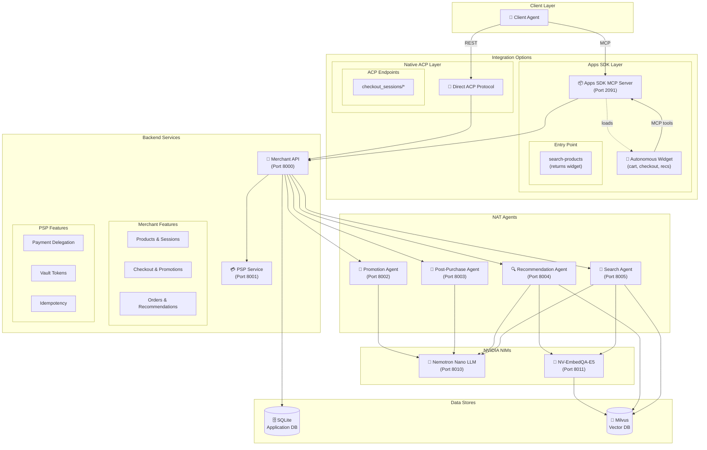

# NVIDIA AI Blueprint: Retail Agentic Commerce

[](LICENSE)
[](https://www.python.org/downloads/)
[](https://nodejs.org/)

A reference implementation of the **Agentic Commerce Protocol (ACP)**: a retailer-operated checkout system that enables agentic negotiation while maintaining merchant control.

<div align="center">


</div>

## What is ACP?

ACP lets AI agents negotiate with merchants on behalf of users. The merchant stays in control while agents can:

- Request promotions and discounts
- Get personalized recommendations
- Complete checkout with delegated payments
- Receive multilingual post-purchase updates

## Architecture



## Quick Start

### Prerequisites

- Python 3.12+
- Node.js 18+
- [uv](https://docs.astral.sh/uv/) package manager
- Docker (optional, for Recommendation Agent)

### 1. Clone and Configure

```bash
git clone https://github.com/NVIDIA/Retail-Agentic-Commerce.git
cd Retail-Agentic-Commerce
cp env.example .env
```

Edit `.env` and add your NVIDIA API key ([get one here](https://build.nvidia.com/settings/api-keys)):

```env
NVIDIA_API_KEY=nvapi-xxx
```

### 2. Backend Services (Merchant, PSP, Apps SDK)

Create and activate a virtual environment, then start the services in separate terminals:

```bash
# Setup (run once)
uv venv
source .venv/bin/activate
uv sync
```

```bash
# Terminal 1: Merchant API (port 8000)
source .venv/bin/activate
uvicorn src.merchant.main:app --reload
```

```bash
# Terminal 2: PSP Service (port 8001)
source .venv/bin/activate
uvicorn src.payment.main:app --reload --port 8001
```

```bash
# Terminal 3: Apps SDK MCP Server (port 2091)
source .venv/bin/activate
uvicorn src.apps_sdk.main:app --reload --port 2091
```

### 3. NAT Agents (Separate Environment)

The agents use their own virtual environment:

```bash
# Setup (run once)
cd src/agents
uv venv
source .venv/bin/activate
uv pip install -e ".[dev]" --prerelease=allow
```

```bash
# Terminal 4: Promotion Agent (port 8002)
cd src/agents
source .venv/bin/activate
nat serve --config_file configs/promotion.yml --port 8002
```

```bash
# Terminal 5: Post-Purchase Agent (port 8003)
cd src/agents
source .venv/bin/activate
nat serve --config_file configs/post-purchase.yml --port 8003
```

```bash
# Terminal 6: Recommendation Agent (port 8004) - requires Docker
cd src/agents
source .venv/bin/activate
nat serve --config_file configs/recommendation-ultrafast.yml --port 8004
```

> **Note**: The Recommendation Agent requires Milvus. See [Optional: Milvus Setup](#optional-milvus-setup) below.

```bash
# Terminal 7: Search Agent (port 8005) - requires Milvus container
cd src/agents
source .venv/bin/activate
nat serve --config_file configs/search.yml --port 8005
```
### 4. Frontend

```bash
# Terminal 8: Demo UI (port 3000)
cd src/ui
cp env.example .env.local
pnpm install
pnpm dev
```

```bash
# Terminal 9: Apps SDK Widget (port 3001) - for development
cd src/apps_sdk/web
pnpm install
pnpm dev
```

### 5. Verify

```bash
curl http://localhost:8000/health  # Merchant API
curl http://localhost:8001/health  # PSP Service
curl http://localhost:2091/health  # Apps SDK
```

### UCP Endpoints

```bash
# Discovery (Phase 1)
curl http://localhost:8000/.well-known/ucp

# Checkout (Phase 2) - requires UCP-Agent header
curl -X POST http://localhost:8000/checkout-sessions \
  -H "Authorization: Bearer test-api-key" \
  -H "UCP-Agent: profile=\"https://platform.example/profile\"" \
  -H "Content-Type: application/json" \
  -d '{"line_items": [{"item": {"id": "prod_1"}, "quantity": 1}]}'
```

Optional environment variables for UCP:

```env
UCP_VERSION=2026-01-11
UCP_BASE_URL=http://localhost:8000
UCP_SERVICE_PATH=/ucp/v1
UCP_SIGNING_KEY_ID=ucp-key-1
UCP_SIGNING_KEY_KTY=EC
UCP_SIGNING_KEY_CRV=P-256
UCP_SIGNING_KEY_ALG=ES256
UCP_SIGNING_KEY_X=
UCP_SIGNING_KEY_Y=
```

Visit **http://localhost:3000** to see the demo UI.

## Services

| Service | Port | Description |
|---------|------|-------------|
| Merchant API | 8000 | ACP/UCP checkout, products, orders |
| PSP Service | 8001 | Payment delegation, vault tokens |
| Apps SDK | 2091 | MCP server for AI agents |
| Promotion Agent | 8002 | Discount strategy (NAT) |
| Post-Purchase Agent | 8003 | Multilingual messages (NAT) |
| Recommendation Agent | 8004 | Personalized recs (requires Docker) |
| Search Agent | 8005 | RAG product search (requires Docker) |

## API Docs

Interactive docs available when services are running:

- **Merchant API**: http://localhost:8000/docs
- **PSP Service**: http://localhost:8001/docs
- **Apps SDK**: http://localhost:2091/docs

## Project Structure

```
src/
├── merchant/          # Merchant API (FastAPI)
├── payment/           # PSP Service (FastAPI)
├── apps_sdk/          # MCP Server + Widget
├── agents/            # NAT Agent configs
└── ui/                # Demo UI (Next.js)

docs/
├── architecture.md    # System design
├── features.md        # Feature status
└── specs/             # Protocol specs
```

## Docker Deployment

The project uses three Docker Compose files:
- **`docker-compose-nim.yml`**: NVIDIA NIM microservices (Nemotron LLM and Embedding models) - start first!
- **`docker-compose.infra.yml`**: Infrastructure (Milvus, Phoenix) - can run standalone for local development
- **`docker-compose.yml`**: Application services (Merchant, PSP, Agents, UI)

### Prerequisites

- Docker 24+
- Docker Compose v2
- NVIDIA GPU(s) with sufficient VRAM (for local NIMs)
- NVIDIA API key (for AI agents)

### Quick Start (Full Docker Deployment)

1. **Configure environment:**

   ```bash
   cp env.example .env
   # Edit .env and add your NVIDIA_API_KEY
   ```

2. **Start NVIDIA NIMs first (downloads large models - 15-30+ min):**

   ```bash
   docker compose -f docker-compose-nim.yml up -d
   ```

3. **Start infrastructure and application services:**

   ```bash
   docker compose -f docker-compose.infra.yml -f docker-compose.yml up -d
   ```

   This starts all services including:
   - nginx (reverse proxy on port 80)
   - Merchant API, PSP, Apps SDK
   - NAT Agents (Promotion, Post-Purchase, Recommendation, Search)
   - Milvus (vector database) and Phoenix (observability)
   - **milvus-seeder** (automatically seeds product embeddings)

4. **Verify NIM health** (wait for models to load):

   ```bash
   curl http://localhost:8010/v1/health/ready  # Nemotron Nano LLM
   curl http://localhost:8011/v1/health/ready  # Embedding Model
   ```

5. **Verify application services:**

   ```bash
   curl http://localhost/api/health      # Merchant API
   curl http://localhost/psp/health      # PSP Service
   curl http://localhost/apps-sdk/health # Apps SDK
   ```

6. **Access the UI** at **http://localhost**

### Service Routes

| Route | Service | Description |
|-------|---------|-------------|
| `/` | UI | Demo frontend |
| `/api/*` | Merchant API | ACP/UCP checkout, products, orders |
| `/psp/*` | PSP Service | Payment delegation |
| `/apps-sdk/*` | Apps SDK | MCP server for AI agents |

### NIM Endpoints

| Service | Port | Description |
|---------|------|-------------|
| Nemotron Nano LLM | 8010 | LLM inference (nvidia/nemotron-3-nano) |
| Embedding Model | 8011 | Text embeddings (nv-embedqa-e5-v5) |

### Infrastructure Endpoints

| Service | Port | Description |
|---------|------|-------------|
| Milvus | 19530 | Vector database gRPC |
| Milvus Health | 9091 | Health check endpoint |
| Phoenix | 6006 | LLM tracing UI |
| MinIO Console | 9001 | Object storage UI |

### Monitoring

```bash
docker compose ps                    # Service status
docker compose logs -f merchant      # Follow merchant logs
docker compose logs nginx            # Check nginx routing
```

### Stopping Services

```bash
# Stop application services only
docker compose down

# Stop everything (infrastructure + application + NIMs)
docker compose -f docker-compose.infra.yml -f docker-compose.yml down
docker compose -f docker-compose-nim.yml down

# Stop and remove volumes (full cleanup)
docker compose -f docker-compose.infra.yml -f docker-compose.yml down -v
docker compose -f docker-compose-nim.yml down -v
```

### Building Images

To rebuild images after code changes:

```bash
docker compose build                 # Rebuild all
docker compose build merchant        # Rebuild specific service
docker compose up -d                 # Restart with new images
```

## Local Development with Infrastructure

For local development, you can run just the infrastructure (Milvus + Phoenix) in Docker while running application services locally. This is useful for debugging and faster iteration.

### 1. Start Infrastructure

```bash
# Start Milvus and Phoenix
docker compose -f docker-compose.infra.yml up -d

# Verify services are running
curl -s http://localhost:9091/healthz   # Milvus health
curl -s http://localhost:6006/          # Phoenix UI
```

### 2. Seed the Vector Database

The Recommendation and Search agents require product embeddings in Milvus.

> **Note**: In Docker deployment, seeding is **automatic** via the `milvus-seeder` container.
> Manual seeding is only required for local development.

```bash
cd src/agents
source .venv/bin/activate
uv run python scripts/seed_milvus.py
```

The seeder script:
- Waits for Milvus to be ready (with retry logic)
- Skips seeding if data already exists
- Supports both NVIDIA API Catalog and local NIM for embeddings

### 3. Run Services Locally

Now start the application services in separate terminals (see [Quick Start](#quick-start) above).

### 4. Stop Infrastructure

```bash
docker compose -f docker-compose.infra.yml down
```


## Documentation

| Document | Description |
|----------|-------------|
| [Architecture](docs/architecture.md) | System design and data flow |
| [Features](docs/features.md) | Feature breakdown and status |
| [ACP Spec](docs/specs/acp-spec.md) | ACP protocol specification |
| [UCP Spec](docs/specs/ucp-spec.md) | UCP protocol specification |
| [Apps SDK](src/apps_sdk/README.md) | MCP server documentation |
| [NAT Agents](src/agents/README.md) | Agent configuration guide |

## Getting Help

- **Issues**: [Open an issue](https://github.com/NVIDIA/Retail-Agentic-Commerce/issues) for bugs or feature requests
- **Security**: See [SECURITY.md](SECURITY.md) for reporting vulnerabilities

## License

This project is licensed under Apache 2.0 - see [LICENSE](LICENSE) for details.

> **Third-Party Software Notice**: This project may download and install additional third-party open source software projects. Review the license terms of these projects before use.
