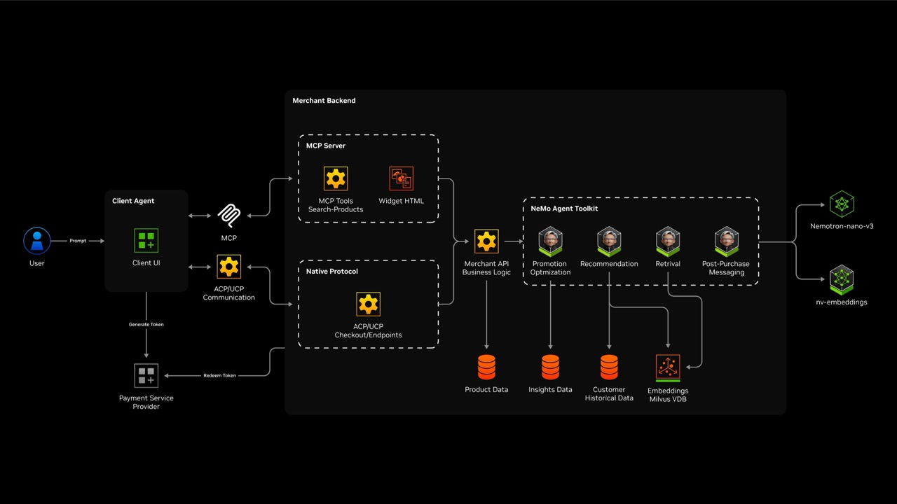
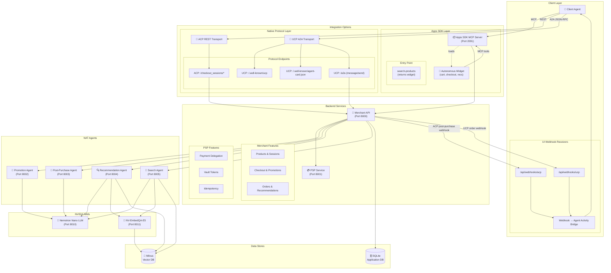

# NVIDIA AI Blueprint: Retail Agentic Commerce

[](LICENSE)
[](https://www.python.org/downloads/)
[](https://nodejs.org/)

<div align="center">


</div>

A reference implementation of the Agentic Commerce Protocol (ACP) and Universal Commerce Protocol (UCP), built for merchant-controlled checkout, payments, and agent orchestration.

## Architecture



## What You Get

- Merchant API (ACP + UCP discovery/A2A)
- PSP service for delegated payment flows
- Apps SDK MCP server + widget
- NAT agents for promotion, recommendations, search, and post-purchase messaging
- Demo UI with protocol and agent activity panels

## Architecture (Default Deployment)



## Quick Start (Cursor, Codex, Claude Code)

This is the recommended path. It does not require local NIM containers.

### Prerequisites

- Python 3.12+
- [uv](https://astral.sh/uv) package manager
- [Node.js 18+](https://nodejs.org/en/download) and [pnpm](https://pnpm.io/)
- Docker 24+ and Docker Compose v2
- NVIDIA API key ([create one](https://build.nvidia.com/settings/api-keys))

### 1. Clone and Configure

```bash
git clone https://github.com/NVIDIA/Retail-Agentic-Commerce.git
cd Retail-Agentic-Commerce
cp env.example .env
```

Update `.env`:

```env
NVIDIA_API_KEY=nvapi-xxx
```

On Cursor, Codex or Claude Code simply run: `/setup`

## Manual Deployment Options

| Mode | Description | Guide |
|------|-------------|-------|
| **Docker** (recommended) | Full stack in containers via Docker Compose | [Docker Deployment](deploy/docker-deployment.md) |
| **Local Development** | Services on host, automated via `install.sh` | [Local Development](deploy/local-development.md) |

Quick local start:

```bash
./install.sh   # install deps + start all 8 services
./stop.sh      # stop everything
```
## Hardware Requirements (Local NIM Deployment)

Local NIM deployment requires NVIDIA GPUs to host the inference models. The following table summarizes the models and their GPU requirements:

| Model | Purpose | Minimum GPU | Recommended GPU |
|-------|---------|-------------|-----------------|
| [Nemotron-Nano-30B-A3B](https://build.nvidia.com/nvidia/nemotron-3-nano-30b-a3b) | LLM — prompt planning, recommendations, search, promotions | 1× A100 (80 GB) | 1× H100 (80 GB) |
| [NV-EmbedQA-E5-v5](https://build.nvidia.com/nvidia/nv-embedqa-e5-v5) | Embedding — semantic search and product retrieval | 1× A100 (80 GB) | 1× H100 (80 GB) |

**Total:** 2× A100 (80 GB) minimum, 2× H100 (80 GB) recommended for best performance.

> **Note:** These requirements apply only to self-hosted local NIM deployment. The default deployment uses public NVIDIA API endpoints and does not require any GPU hardware.

## Optional: Local NIM Deployment (GPU)

Only needed for self-hosted local inference. The default deployment already works with public endpoints.

For step-by-step instructions (prerequisites, GPU setup, NIM containers, validation), see the **[Local NIM Deployment Notebook](deploy/1_Deploy_Agentic_Commerce.ipynb)**.

## Project Structure

```text
src/
├── merchant/      # Merchant API (FastAPI)
├── payment/       # PSP service (FastAPI)
├── apps_sdk/      # MCP server + widget
├── agents/        # NAT agents and configs
└── ui/            # Next.js demo UI

deploy/
├── docker-deployment.md
├── local-development.md
└── 1_Deploy_Agentic_Commerce.ipynb

docs/
├── architecture.md
├── features/
└── specs/
```

## Documentation

- [Docker Deployment](deploy/docker-deployment.md)
- [Local Development](deploy/local-development.md)
- [Architecture](docs/architecture.md)
- [Feature Breakdown](docs/features/index.md)
- [ACP Spec](docs/specs/acp-spec.md)
- [UCP Spec](docs/specs/ucp-spec.md)
- [Apps SDK Spec](docs/specs/apps-sdk-spec.md)
- [Agent Integration](src/agents/README.md)

## License

GOVERNING TERMS: The Blueprint scripts are governed by Apache License, Version 2.0, and enables use of separate open source and proprietary software governed by their respective licenses: [Nemotron-Nano-V3](https://catalog.ngc.nvidia.com/orgs/nim/teams/nvidia/containers/nemotron-3-nano?version=1.7.0), (ii) MIT license for [NV-EmbedQA-E5-v5](https://build.nvidia.com/nvidia/nv-embedqa-e5-v5).

This project will download and install additional third-party open source software projects. Review the license terms of these open source projects before use, found in [License-3rd-party.txt](/LICENSE-3rd-party.txt).

Use of the product catalog data in the retail agentic commerce is governed by the terms of the [NVIDIA Data License for Retail Agentic Commerce](/LICENSE-assets.txt) (2026).