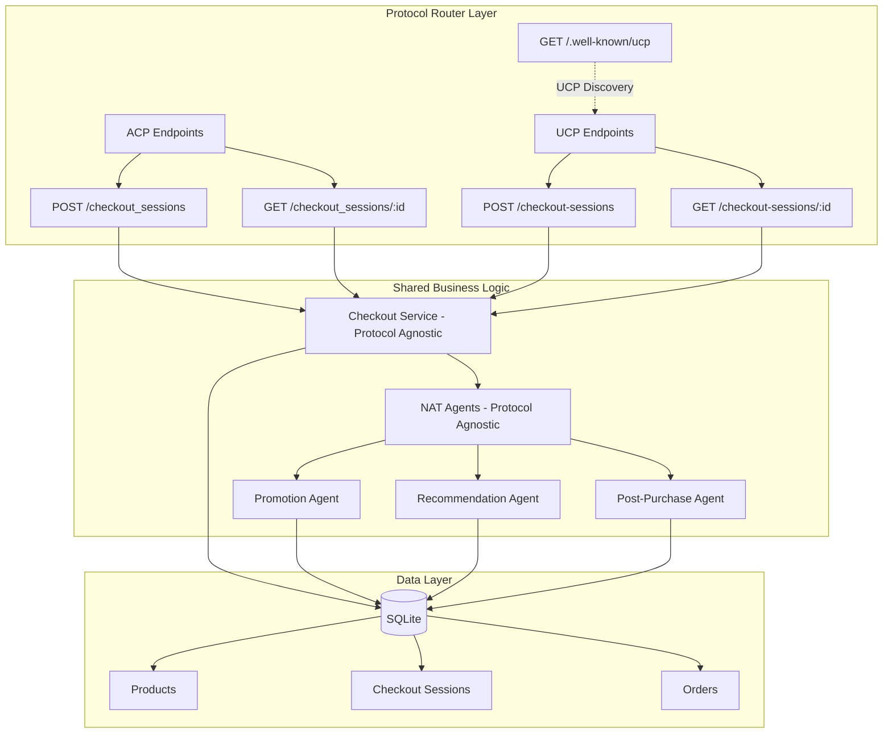
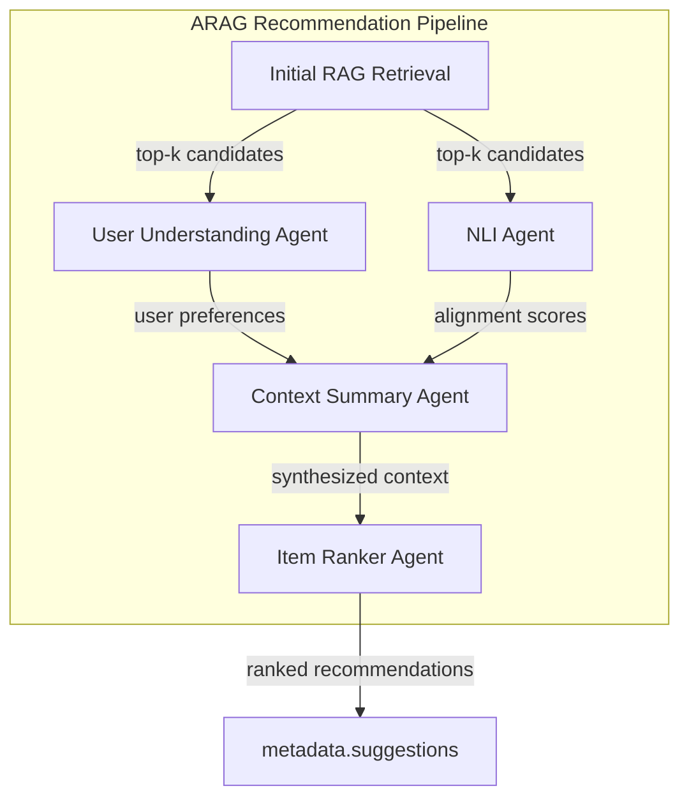

### Fullstack Architecture: Section 1

**Section:** Introduction & High-Level Architecture

#### **Drafting Rationale:**

* **The Bridge**: This architecture must serve as a high-fidelity translator between the client's asynchronous intent and the merchant's synchronous relational data.
* **The Intelligence**: We are moving beyond simple API routes to an **Orchestrated Agentic Layer** where FastAPI acts as the host for NAT workflows.
* **The Relational Core**: Using **SQLModel** (SQLite) provides the structured environment NeMo agents need for precise business reasoning (e.g., margin calculation).

---

### Draft Content: High-Level Overview

**1. Technical Summary**
The **Intelligent Commerce Middleware** is a Python **3.12+**-based reference architecture designed to host autonomous merchant agents. It exposes **two protocol implementations**:

1. **ACP (Agentic Commerce Protocol)** - Five RESTful endpoints compliant with v2026-01-16
2. **UCP (Universal Commerce Protocol)** - Industry-standard protocol aligned to v2026-01-11 (Discovery + Checkout, REST only in this project)

Both protocols utilize the **NVIDIA NeMo Agent Toolkit** to perform real-time business logic optimization. The system uses an "Async Parallel Orchestration" pattern to ensure fast, responsive agent reasoning while sharing the same intelligent agent layer and backend services.

**Simulator (demo client)**
We will also build a **client agent simulator** that plays the "client" role:

* **Implementation**: Static simulator with pre-defined user flows and 4 pre-populated products
* **Search Flow**: User enters a prompt (e.g., "find some t-shirts") → Simulator displays 4 product cards
* **Checkout Flow**: User clicks a product → Simulator initiates `POST /checkout_sessions` to start the ACP checkout

**2. High-Level Project Diagram**

```mermaid
graph TD
    subgraph "Consumer Interface"
        A[Client Agent Simulator]
        J[Product Cards UI]
        TABS[Mode: Native ACP | Apps SDK]
    end

    subgraph "Apps SDK Mode"
        MERCHANT_IFRAME[Merchant-Owned Iframe]
        LOYALTY[Loyalty Points Display]
        REC_CAROUSEL[Recommendations Carousel]
        SHOP_CART[Shopping Cart]
    end

    subgraph "Intelligent Middleware (FastAPI)"
        ROUTER[Protocol Router Layer]
        ACP_ROUTER[ACP Endpoints]
        UCP_ROUTER[UCP Endpoints + Discovery]
        ROUTER --> ACP_ROUTER & UCP_ROUTER
        C[Shared Business Logic Layer]
        D[NAT Promotion Agent]
        E[NAT Recommendation Agent]
        F[NAT Post-Purchase Agent]
        ACP_ROUTER --> C
        UCP_ROUTER --> C
        C --> D & E & F
    end

    subgraph "Relational Data (SQLite)"
        G[(Product Catalog - 4 items)]
        H[(Competitor Data)]
        I[(Order History)]
    end

    subgraph "Demo Interface (Next.js - Multi-Panel UI)"
        K1[Left: Agent/Client Simulation]
        K2[Middle: Merchant Activity Panel]
        K2_ACP[ACP Tab]
        K2_UCP[UCP Tab]
        K2 --> K2_ACP & K2_UCP
        K3[Right: Agent Activity]
    end

    subgraph "Payments (PSP)"
        P1[delegate_payment → vt_...]
        P2[create_and_process_payment_intent → pi_...]
        P3[3DS Authentication]
    end

    subgraph "Webhooks"
        W[Global Webhook Endpoint]
    end

    A -->|UI resources| J
    A -->|Mode switch| TABS
    TABS -->|Apps SDK| MERCHANT_IFRAME
    MERCHANT_IFRAME --> LOYALTY & REC_CAROUSEL & SHOP_CART
    REC_CAROUSEL -.->|Fetches 3 items| E
    SHOP_CART -->|callTool checkout| ACP_ROUTER
    A -->|ACP REST| ACP_ROUTER
    A -->|UCP REST + UCP-Agent header| UCP_ROUTER
    D & E & F <-->|SQL Queries| G & H & I
    A -.->|Simulation View| K1
    ACP_ROUTER -.->|ACP JSON| K2_ACP
    UCP_ROUTER -.->|UCP JSON + Capabilities| K2_UCP
    D & E & F -.->|Agent Reasoning| K3
    A -->|delegate payment| P1
    P1 -->|vault token| A
    C -->|complete checkout (token)| P2
    P2 -.->|3DS required?| P3
    P3 -->|authentication_result| C
    F -->|Post-purchase events| W

```

**3. Dual Protocol Architecture**

The system implements **both ACP and UCP protocols** to demonstrate how merchants can support multiple commerce standards simultaneously.

**Protocol Toggle:** The Merchant Activity Panel has a tab switcher (ACP | UCP) that determines which backend protocol is used. The **client agent flow remains unchanged** - same product cards, checkout modal, and shipping selection. Only the backend endpoints and protocol format change based on the toggle.

```
┌─────────────────────────────────────────────────────────────────────────┐
│                        PROTOCOL TOGGLE BEHAVIOR                          │
│                                                                          │
│   Merchant Panel Toggle                                                  │
│   ┌────────────────┬────────────────┐                                   │
│   │     [ACP]      │     [UCP]      │                                   │
│   └───────┬────────┴────────┬───────┘                                   │
│           │                 │                                            │
│           ▼                 ▼                                            │
│   POST /checkout_sessions   POST /checkout-sessions (REST)              │
│   (underscore, REST)        OR a2a.ucp.checkout.create (A2A)            │
│                                                                          │
│   ✓ Same Client Agent UI   ✓ Same Client Agent UI                       │
│   ✓ Same NAT Agents        ✓ Same NAT Agents                            │
│   ✓ Same PSP Payments      ✓ Same PSP Payments                          │
└─────────────────────────────────────────────────────────────────────────┘
```



### Protocol Comparison

| Aspect | ACP | UCP |
|--------|-----|-----|
| **Discovery** | Static config | `GET /.well-known/ucp` |
| **Versioning** | Header: `API-Version: 2026-01-16` | Profile + negotiation: `2026-01-11` |
| **Transport** | REST only | REST + A2A (JSON-RPC 2.0) |
| **Session Endpoint** | `POST /checkout_sessions` | `POST /checkout-sessions` or `a2a.ucp.checkout.create` |
| **Update Method** | `POST /checkout_sessions/{id}` | `PUT /checkout-sessions/{id}` or `a2a.ucp.checkout.update` |
| **Status Names** | `not_ready_for_payment`, `ready_for_payment` | `incomplete`, `requires_escalation`, `ready_for_complete`, `complete_in_progress` |
| **Response Metadata** | Payment provider info | `ucp` object with capabilities |
| **Platform Advertisement** | API key (`Authorization` / `X-API-Key`) + `API-Version` | `UCP-Agent: profile="..."` (RFC 8941) |
| **Buyer Handoff** | ACP UI-specific | `continue_url` required for `requires_escalation` |
| **Fulfillment** | `fulfillment_details` object | `fulfillment` extension with methods |

### Shared Components

The following components are **protocol-agnostic** and serve both ACP and UCP:

1. **NAT Agents**
   - Promotion Agent: Dynamic pricing based on competitor data
   - Recommendation Agent: ARAG-powered cross-sell suggestions
   - Post-Purchase Agent: Multilingual shipping updates

2. **Checkout Service**
   - Session management
   - Cart operations
   - Totals calculation
   - Validation logic

3. **Payment Service**
   - PSP delegation
   - Vault token handling
   - Payment intent processing
   - 3DS authentication flow

4. **Database Layer**
   - Products catalog
   - Checkout sessions (protocol field stores ACP vs UCP)
   - Orders and history

### Request Flow Example

**ACP Flow:**
```
Client Agent
  ↓ POST /checkout_sessions (Header: API-Version: 2026-01-16)
ACP Router
  ↓ normalize to internal format
Shared Checkout Service
  ↓ invoke agents
NAT Agents (Promotion, Recommendation)
  ↓ return decisions
Shared Checkout Service
  ↓ transform to ACP response format
ACP Router
  ↓ Response with payment_provider, status: ready_for_payment
Client Agent
```

**UCP Flow:**
```
Client Agent
  ↓ POST /checkout-sessions (Header: UCP-Agent: profile="...")
UCP Router
  ↓ fetch platform profile, compute capabilities
  ↓ normalize to internal format
Shared Checkout Service
  ↓ invoke agents
NAT Agents (Promotion, Recommendation)
  ↓ return decisions
Shared Checkout Service
  ↓ transform to UCP response format
UCP Router
  ↓ inject negotiated capabilities relevant to checkout in ucp metadata
  ↓ Response with ucp.capabilities, status: ready_for_complete
Client Agent
```

**4. Key Architectural Patterns**

* **Async Parallel Orchestrator**: The Promotion and Recommendation agents are triggered simultaneously via `asyncio.gather` during session creation.
* **Tool-Calling SQL Bridge**: NAT agents do not access the DB directly; they use specific **Python Tools** that execute sanitized SQL queries to prevent injection.
* **ARAG Multi-Agent Recommendation**: The Recommendation Agent implements an **Agentic Retrieval Augmented Generation (ARAG)** architecture based on [research from SIGIR 2025](https://arxiv.org/pdf/2506.21931). This approach uses 4 specialized LLM agents working in a coordinated pipeline:



  The ARAG pattern provides:
  - **42% improvement** in recommendation quality over vanilla RAG (per research benchmarks)
  - **Parallel execution** of User Understanding and NLI agents for reduced latency
  - **Semantic alignment scoring** to filter irrelevant candidates before ranking
  - **Reasoning trace** for each recommendation, displayed in Protocol Inspector
* **Multi-Panel Glass-Box Observability**: The Protocol Inspector uses a three-panel synchronized view:
  * **Left Panel**: Agent/Client simulation showing the customer experience
  * **Middle Panel**: Business/Retailer view with JSON payloads and protocol state
  * **Right Panel (Optional)**: Chain of thought showing agent reasoning traces from NeMo Agent Toolkit
  * **Default**: publish a **structured/redacted explainability trace** (safe-to-display steps + tool inputs/outputs).
  * **Demo/Debug**: optionally publish **raw chain-of-thought-style output** if available, explicitly labeled and only enabled for demos.
* **Simulator Flow**:
  1. User enters search query (e.g., "find some t-shirts")
  2. Simulator displays 4 product cards with images and prices
  3. User clicks a product to start checkout via ACP protocol
* **Static Product Catalog**: 4 pre-populated products stored in SQLite.
* **Delegated Payments (PSP)** - ACP-compliant payment flow (UCP uses payment handlers; this demo may map handlers to the same PSP flow):
  1. **Client/Agent obtains vault token**: `POST /agentic_commerce/delegate_payment`
     - Sends: `payment_method` (card details), `allowance` (constraints), `risk_signals`
     - Requires: `Idempotency-Key` header for safe retries
     - Returns: Vault token `vt_...` with metadata
  2. **Client/Agent completes checkout**: `POST /checkout_sessions/{id}/complete`
     - Sends: `payment_data` with vault token and provider
     - May return: `status: authentication_required` (3DS needed)
  3. **3D Secure flow** (if required):
     - Session returns `authentication_metadata` with challenge URL
     - Client redirects user or embeds 3DS challenge
     - After 3DS completion, client calls complete again with `authentication_result`
  4. **Merchant processes payment**: Calls PSP `create_and_process_payment_intent`
     - Validates vault token is `active` and not expired
     - Validates amount within `allowance.max_amount`
     - Marks vault token as `consumed` (single-use)
     - Creates order on success
* **Global Webhook Delivery**: Post-purchase shipping pulses are delivered to a **single global webhook URL** configured at the application level (ACP demo flow). UCP order webhooks are out of scope for this implementation.
* **Configurable NIM Endpoint**: Supports both NVIDIA hosted API and local Docker deployment via environment variable.
* **API Key Auth**: All ACP endpoints require an API key (e.g., `Authorization: Bearer <API_KEY>` or `X-API-Key: <API_KEY>`). Unauthorized requests return 401/403.
* **Apps SDK Integration**: An alternative checkout mode where the merchant controls a fully-owned iframe embedded within the Client Agent panel:

```mermaid
graph TD
    subgraph "Client Agent Panel"
        TAB[Tab Switcher: Native ACP | Apps SDK]
        NATIVE[Native ACP Mode]
        APPSDK[Apps SDK Mode]
    end

    subgraph "Apps SDK Mode"
        IFRAME[Merchant Iframe]
        LOYALTY[Loyalty Points Display]
        CAROUSEL[ARAG Recommendations Carousel]
        CART[Shopping Cart - Multi-item]
        CHECKOUT_BTN[Checkout Button]
    end

    subgraph "Communication Bridge"
        BRIDGE[Simulated window.openai]
        POSTMSG[postMessage Protocol]
    end

    subgraph "Existing ACP Flow"
        ACP_SESSION[POST /checkout_sessions]
        PSP_DELEGATE[POST /delegate_payment]
        ACP_COMPLETE[POST /complete]
    end

    TAB -->|Switch| NATIVE
    TAB -->|Switch| APPSDK
    APPSDK --> IFRAME
    IFRAME --> LOYALTY
    IFRAME --> CAROUSEL
    IFRAME --> CART
    CART --> CHECKOUT_BTN
    CHECKOUT_BTN -->|callTool| BRIDGE
    BRIDGE -->|postMessage| POSTMSG
    POSTMSG --> ACP_SESSION
    ACP_SESSION --> PSP_DELEGATE
    PSP_DELEGATE --> ACP_COMPLETE

    CAROUSEL -.->|Fetches from| ARAG[ARAG Recommendation Agent]
```

  The Apps SDK pattern provides:
  - **Merchant UI Control**: Merchant owns the HTML/CSS/JS within the iframe
  - **ARAG-Powered Recommendations**: 3 personalized items from the Recommendation Agent
  - **Shopping Cart**: Multi-item cart (vs single product in native mode)
  - **Loyalty Integration**: Pre-authenticated user with points display
  - **Same Payment Flow**: Uses identical ACP + PSP payment infrastructure

* **Apps SDK Testing Modes**: The implementation supports three testing environments per Apps SDK deployment guidelines:

```mermaid
graph TD
    subgraph "Mode 1: Standalone"
        S1[Protocol Inspector]
        S2[Merchant Iframe]
        S3[Simulated window.openai]
        S1 --> S2
        S2 --> S3
    end

    subgraph "Mode 2: Client Agent Integration"
        C1[Client Agent]
        C2[ngrok Tunnel]
        C3[MCP Server localhost:2091]
        C4[Widget Bundle]
        C1 -->|/mcp| C2
        C2 --> C3
        C3 -->|outputTemplate| C4
    end

    subgraph "Mode 3: Production"
        P1[Client Agent]
        P2[MCP Server Vercel/Alpic]
        P3[Widget CDN]
        P1 -->|HTTPS| P2
        P2 --> P3
    end
```



  - **Standalone**: Local development with simulated client agent bridge
  - **Client Agent Integration**: Testing with a real client agent via ngrok tunnel before production
  - **Production**: Deployed MCP server accessible from the client agent's app directory

---

**4. Brand Persona Configuration**

The Post-Purchase Agent uses a **Brand Persona** to generate human-like shipping updates:

```json
{
  "company_name": "Acme T-Shirts",
  "tone": "friendly",
  "preferred_language": "en"
}
```

| Field | Type | Description | Example Values |
| --- | --- | --- | --- |
| `company_name` | `string` | Brand name for personalized messaging | "Acme T-Shirts" |
| `tone` | `string` | Communication style | "friendly", "professional", "casual", "urgent" |
| `preferred_language` | `string` | ISO 639-1 language code | "en", "es", "fr" |
