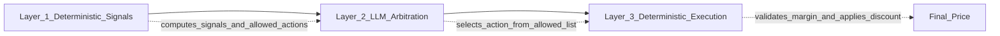
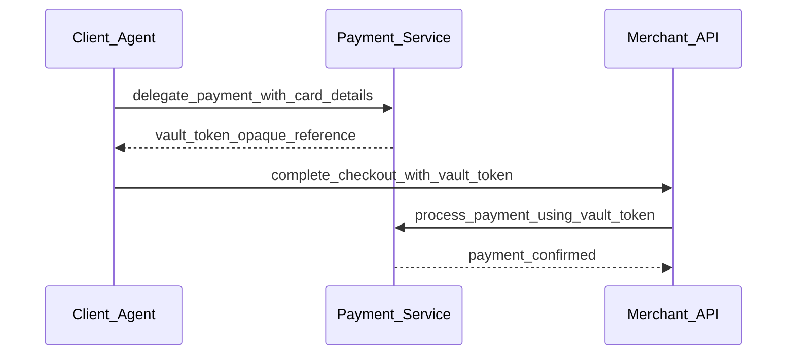
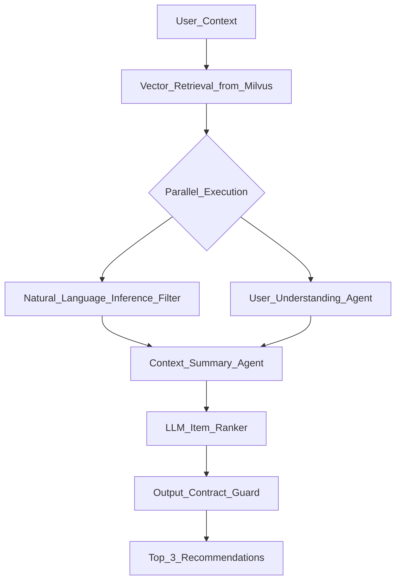

# Architecture Decision Records (ADR)

This document captures the key architectural decisions made during the design and implementation of the Retail Agentic Commerce platform, including context, rationale, alternatives considered, and consequences.

---

## ADR-001: Dual Protocol Support (ACP and UCP)

**Status**: Accepted  
**Date**: 2026-01-16  
**Context**: The platform needs to support standardized agent-to-merchant communication. Two emerging protocols exist: ACP (REST-based, simpler) and UCP (JSON-RPC A2A, richer capability negotiation).  

**Decision**: Support both ACP and UCP protocols through a shared domain layer with protocol-specific adapters.

**Rationale**:
- ACP is simpler for initial integrations and Apps SDK consumers
- UCP provides richer agent discovery, capability negotiation, and standardized A2A transport
- Shared business logic avoids protocol-specific code duplication
- Demonstrates protocol interoperability for the reference implementation

**Alternatives Considered**:
| Alternative | Pros | Cons |
|-------------|------|------|
| ACP only | Simpler to implement | Limits agent discovery patterns |
| UCP only | Richer protocol | Higher barrier to entry for integrators |
| Protocol abstraction layer | Cleaner separation | Over-engineering for two protocols |

**Consequences**:
- Protocol-specific routers exist in `protocols/acp/` and `protocols/ucp/`
- Domain models in `domain/checkout/` are protocol-agnostic
- Frontend must include protocol adapter logic in API client
- UCP adds discovery endpoint (`.well-known/ucp`) and A2A JSON-RPC router

---

## ADR-002: Three-Layer Hybrid Promotion Architecture

**Status**: Accepted  
**Date**: 2026-01-16  
**Context**: Dynamic pricing requires balancing business rules (margin protection, inventory signals) with the flexibility of LLM-based decision-making.

**Decision**: Implement a three-layer architecture: (1) Deterministic signal computation, (2) LLM arbitration within constrained action space, (3) Deterministic execution with margin validation.

**Rationale**:
- Layer 1 ensures the LLM only sees margin-safe options (fail-closed)
- Layer 2 uses context-aware reasoning to select the optimal promotion
- Layer 3 validates the decision deterministically before applying
- If the LLM returns an invalid action, the system falls back safely to NO_PROMO

**Alternatives Considered**:
| Alternative | Pros | Cons |
|-------------|------|------|
| Pure rule engine | Predictable, fast | Cannot adapt to nuanced context |
| Pure LLM | Flexible, creative | Risk of margin-violating decisions |
| LLM with post-validation | Simpler pipeline | Frequent rejections waste inference cost |

**Consequences**:
- Promotion agent is stateless; all state is computed by Layer 1
- Margin constraints are always enforced regardless of agent behavior
- Agent failures result in no discount rather than errors
- System prompt must be maintained alongside business signal definitions

---

## ADR-003: SQLite for Data Persistence

**Status**: Accepted  
**Date**: 2026-01-16  
**Context**: The reference implementation needs a relational database for checkout sessions, products, and payment records. The system is designed for demonstration and development, not production scale.

**Decision**: Use SQLite as the primary database for both Merchant and PSP services, with shared volume in Docker deployment.

**Rationale**:
- Zero configuration and no external database server required
- Perfect for single-node development and demonstration
- SQLModel/SQLAlchemy abstraction makes future migration straightforward
- Shared volume (`acp-data`) allows both services to co-locate database files

**Alternatives Considered**:
| Alternative | Pros | Cons |
|-------------|------|------|
| PostgreSQL | Production-grade, concurrent writes | Adds infrastructure complexity |
| In-memory only | Fastest, simplest | No persistence across restarts |
| DynamoDB/Cosmos | Cloud-native | Vendor lock-in, not self-contained |

**Consequences**:
- Single writer limitation (acceptable for reference implementation)
- Migration to PostgreSQL requires only connection string change
- Database files persist via Docker volumes
- No need for migration tooling in current phase

---

## ADR-004: In-Memory Cart Storage (Apps SDK)

**Status**: Accepted  
**Date**: 2026-01-16  
**Context**: The Apps SDK MCP server needs to maintain shopping cart state across tool invocations within a user session.

**Decision**: Store cart state in an in-memory Python dictionary within the Apps SDK process.

**Rationale**:
- Simplest possible implementation for reference/demo
- Cart lifecycle is short (single checkout session)
- No external state store dependency
- MCP tools are stateless HTTP calls; cart ID is passed by the client

**Alternatives Considered**:
| Alternative | Pros | Cons |
|-------------|------|------|
| Redis | Distributed, persistent, TTL | External dependency |
| Database | Persistent, queryable | Over-engineering for session data |
| Client-side storage | No server state | Security and consistency concerns |

**Consequences**:
- Cart data is lost on Apps SDK restart
- Not suitable for horizontal scaling (sticky sessions would be needed)
- Cart ID-based routing enables future migration to Redis

---

## ADR-005: NeMo Agent Toolkit (NAT) for Agent Orchestration

**Status**: Accepted  
**Date**: 2026-01-16  
**Context**: AI agents need a framework for prompt management, tool registration, multi-step workflows, and NVIDIA NIM integration.

**Decision**: Use NVIDIA NeMo Agent Toolkit (NAT) as the agent orchestration framework for all four agents.

**Rationale**:
- Native integration with NVIDIA NIM endpoints
- YAML-based configuration for agent behavior
- Built-in support for chat_completion and ARAG workflows
- Custom component registration (parallel execution, RAG retriever, output guard)
- `nat serve` provides HTTP server with health checks out of the box

**Alternatives Considered**:
| Alternative | Pros | Cons |
|-------------|------|------|
| LangChain | Large ecosystem | More complex, not NIM-native |
| Custom framework | Full control | Significant development effort |
| OpenAI Assistants API | Managed service | Vendor lock-in, not self-hosted |

**Consequences**:
- Agent configs are YAML files in `src/agents/configs/`
- Custom Python components registered via `register.py`
- Tight coupling to NAT lifecycle (`nat serve`, `nat validate`)
- NVIDIA NIM is the default LLM provider

---

## ADR-006: Server-Sent Events (SSE) for Real-Time UI Updates

**Status**: Accepted  
**Date**: 2026-01-16  
**Context**: The three-panel UI needs real-time updates for checkout events and agent activity without polling.

**Decision**: Use Server-Sent Events (SSE) from the Apps SDK to push checkout and agent activity events to the frontend.

**Rationale**:
- One-way server-to-client streaming is sufficient (UI does not push events back)
- Simpler than WebSockets for unidirectional data
- Native browser support via EventSource API
- Automatic reconnection built into EventSource

**Alternatives Considered**:
| Alternative | Pros | Cons |
|-------------|------|------|
| WebSockets | Bidirectional | Complexity for one-way data |
| Polling | Simple to implement | Latency, unnecessary requests |
| gRPC-Web streaming | Efficient binary protocol | Browser compatibility, complexity |

**Consequences**:
- Apps SDK maintains event history and SSE endpoint (`/events`)
- Frontend connects via `useCheckoutEvents` hook
- Event types: `checkout_event` and `agent_activity_event`
- Clear event endpoint (`DELETE /events`) for session reset

---

## ADR-007: Vault Token Payment Delegation Pattern

**Status**: Accepted  
**Date**: 2026-01-16  
**Context**: The checkout flow requires secure payment processing where the client agent provides payment details, but the merchant processes the actual charge.

**Decision**: Implement a vault token delegation pattern where the PSP stores payment methods and returns a opaque token that the merchant uses to initiate payment.

**Rationale**:
- Payment details never touch the merchant server (PCI compliance pattern)
- Single-use tokens prevent replay attacks
- Allowance mechanism limits token to specific checkout session and amount
- Idempotent token creation prevents duplicate charges

**Alternatives Considered**:
| Alternative | Pros | Cons |
|-------------|------|------|
| Direct card to merchant | Simpler | PCI compliance burden on merchant |
| Stripe-style payment intents | Industry standard | External dependency |
| Client-side tokenization | Minimal server exposure | Requires JavaScript SDK |

**Consequences**:
- Two-step payment: delegate then process
- Vault tokens are single-use (consumed after payment)
- PSP tracks token lifecycle (active to consumed)
- Allowance binds token to specific session and amount

---

## ADR-008: Model Context Protocol (MCP) for Apps SDK

**Status**: Accepted  
**Date**: 2026-01-16  
**Context**: The Apps SDK needs a standardized interface for AI agents to invoke shopping tools (search, cart, checkout).

**Decision**: Implement the Apps SDK as an MCP server with stateless HTTP transport, exposing shopping operations as MCP tools.

**Rationale**:
- MCP is an emerging standard for AI agent tool invocation
- Stateless HTTP transport is simple and scalable
- Tools have typed input/output schemas for validation
- Dual access: MCP tools for agents, REST endpoints for traditional clients

**Alternatives Considered**:
| Alternative | Pros | Cons |
|-------------|------|------|
| REST-only API | Universal client support | No tool schema discovery |
| OpenAPI + function calling | Wide LLM support | Less structured than MCP |
| gRPC | High performance | Complexity, limited browser support |

**Consequences**:
- Ten MCP tools registered in `main.py`
- Parallel REST endpoints in `rest_endpoints.py` for non-MCP clients
- Tools share service implementations with REST routes
- MCP client integration in frontend via `useMCPClient` hook

---

## ADR-009: ARAG Pipeline for Recommendations

**Status**: Accepted  
**Date**: 2026-01-16  
**Context**: Product recommendations need to be contextually relevant, considering the current product, cart contents, and user intent.

**Decision**: Use an Agentic Retrieval-Augmented Generation (ARAG) pipeline that combines vector retrieval, parallel NLI/UUA agents, context synthesis, and LLM ranking.

**Rationale**:
- Vector retrieval provides candidate diversity from the full catalog
- NLI agent filters irrelevant candidates
- UUA agent captures user intent signals
- Parallel execution reduces latency
- Output contract guard ensures schema compliance
- Top-3 limit prevents overwhelming the user

**Alternatives Considered**:
| Alternative | Pros | Cons |
|-------------|------|------|
| Collaborative filtering | Fast, proven | Requires historical data |
| Embedding similarity only | Simple | No reasoning about user intent |
| Single LLM call | Fewer components | Less reliable, no schema guarantee |

**Consequences**:
- Requires Milvus vector database with pre-seeded product embeddings
- Four-agent pipeline increases latency but improves relevance
- Parallel execution via custom `parallel_execution` NAT component
- Output contract guard validates JSON schema before returning

---

## ADR-010: Monorepo with Docker Compose Orchestration

**Status**: Accepted  
**Date**: 2026-01-16  
**Context**: Eight services (merchant, PSP, apps-sdk, UI, four agents) plus infrastructure (Milvus, Phoenix) need coordinated deployment.

**Decision**: Use a single monorepo with Docker Compose for multi-service orchestration.

**Rationale**:
- Single clone to full running system
- Shared code (product catalog data layer) is directly importable
- Docker Compose manages dependency ordering and networking
- Separate compose files for app and infra services
- `install.sh` provides one-command local setup

**Alternatives Considered**:
| Alternative | Pros | Cons |
|-------------|------|------|
| Separate repos | Independent versioning | Complex setup, code duplication |
| Kubernetes | Production-grade | Heavy for development |
| Single monolith | Simplest deployment | Violates service boundaries |

**Consequences**:
- All services share the root `pyproject.toml` for common dependencies
- Agents have their own `pyproject.toml` for NAT-specific dependencies
- `docker-compose.yml` for app services, `docker-compose.infra.yml` for infrastructure
- `docker-compose-nim.yml` overlay for local NIM deployment
- Shared Docker volume (`acp-data`) for database files
