# C4 and TOGAF Diagrams

All diagrams in this document use Mermaid.js syntax and follow TOGAF alignment for logical, application, and technology views. Labels use only alphanumeric characters and underscores.

---

## 1. C4 Model Diagrams

### 1.1 Level 1: System Context Diagram

Shows the Retail Agentic Commerce system in relation to its users and external systems.

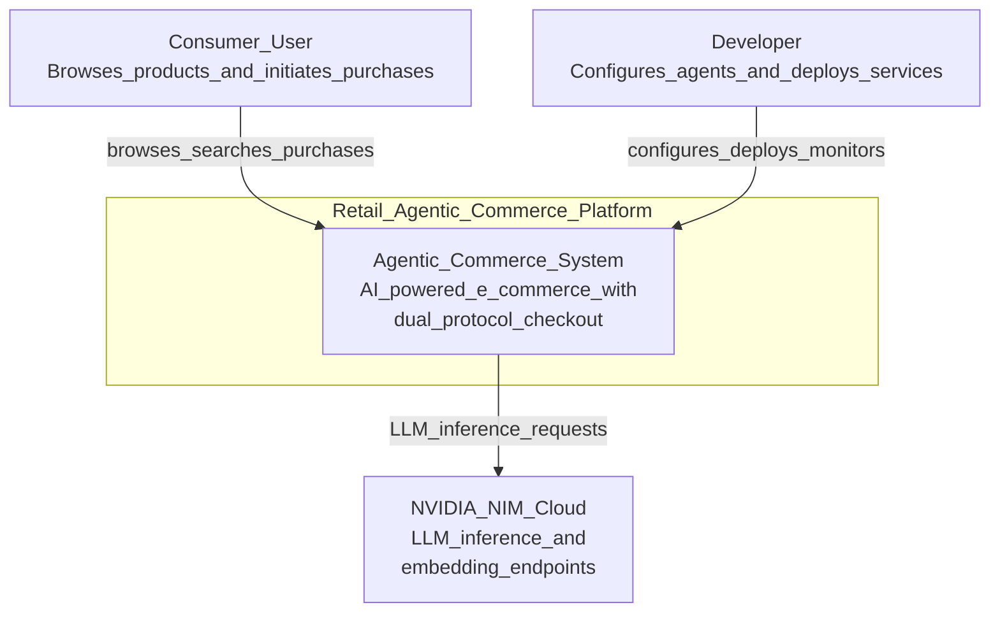

### 1.2 Level 2: Container Diagram

Shows the high-level containers (services) within the system.

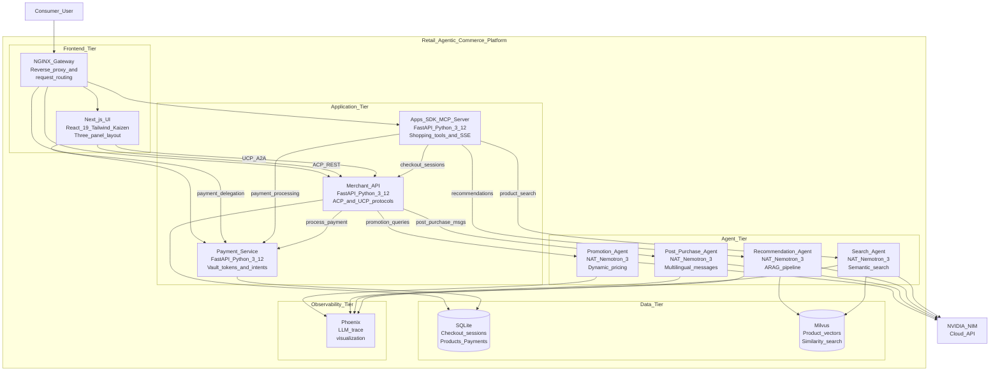

### 1.3 Level 3: Component Diagram — Merchant Service

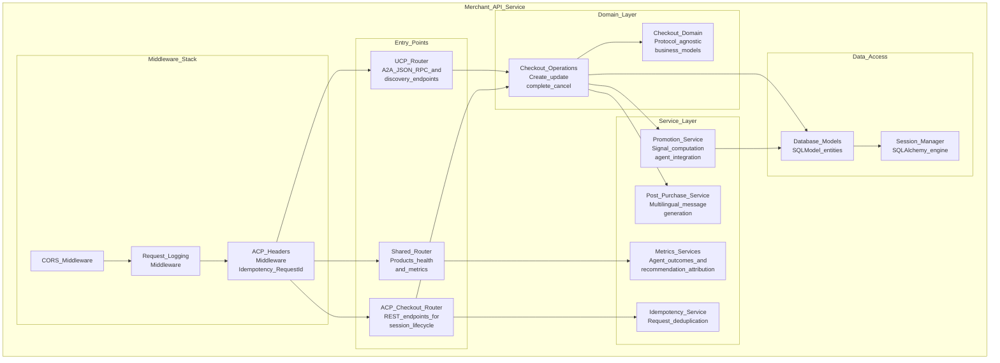

### 1.4 Level 3: Component Diagram — Apps SDK

```mermaid
graph TB
    subgraph Apps_SDK_MCP_Server
        subgraph MCP_Transport
            HTTPTransport[Stateless_HTTP<br>MCP_Transport]
        end

        subgraph MCP_Tools
            SearchTool[search_products<br>Semantic_product_search]
            RecoTool[get_recommendations<br>ARAG_personalized_recs]
            AddCartTool[add_to_cart<br>Add_item_to_cart]
            RemoveCartTool[remove_from_cart<br>Remove_cart_item]
            UpdateCartTool[update_cart_quantity<br>Change_item_qty]
            GetCartTool[get_cart<br>Retrieve_cart_state]
            CheckoutTool[checkout<br>Full_checkout_flow]
            TrackTool[track_recommendation_click<br>Attribution_event]
            CreateSessionTool[create_acp_session<br>Start_ACP_checkout]
            UpdateSessionTool[update_acp_session<br>Modify_ACP_session]
        end

        subgraph REST_Endpoints
            CartREST[Cart_REST_API<br>add_update_shipping]
            CheckoutREST[Checkout_REST<br>Process_purchase]
            SessionREST[Session_REST<br>Manage_active_sessions]
            EventsREST[Events_SSE<br>Real_time_stream]
        end

        subgraph Internal_Services
            CartManager[Cart_Manager<br>In_memory_cart_store]
            EventEmitter[Event_Emitter<br>SSE_event_bus]
            RecoHelpers[Recommendation_Helpers<br>Attribution_tracking]
        end
    end

    HTTPTransport --> MCP_Tools
    MCP_Tools --> CartManager
    MCP_Tools --> EventEmitter
    REST_Endpoints --> CartManager
    REST_Endpoints --> EventEmitter
    RecoTool --> RecoHelpers
    TrackTool --> RecoHelpers
```

### 1.5 Level 3: Component Diagram — Recommendation Agent

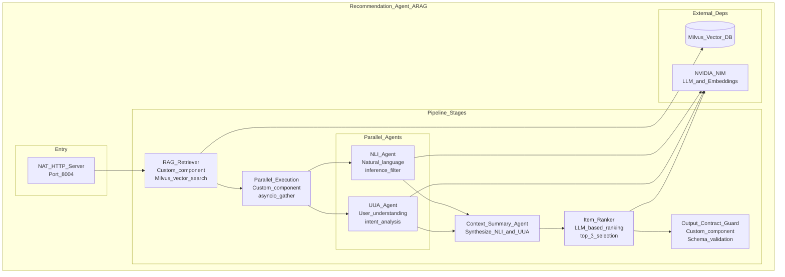

---

## 2. TOGAF-Aligned Architecture Views

### 2.1 Business Architecture View

Mapping of business capabilities to system components.

```mermaid
graph TB
    subgraph Business_Capabilities
        ProductDiscovery[Product_Discovery<br>Search_browse_recommend]
        CartManagement[Cart_Management<br>Add_remove_update_items]
        CheckoutProcess[Checkout_Processing<br>Session_fulfillment_payment]
        DynamicPricing[Dynamic_Pricing<br>AI_driven_promotions]
        PaymentProcessing[Payment_Processing<br>Tokenized_card_payments]
        PostPurchaseComms[Post_Purchase_Communications<br>Order_status_messages]
        AgentOrchestration[Agent_Orchestration<br>Multi_agent_coordination]
        ProtocolCompliance[Protocol_Compliance<br>ACP_UCP_standards]
    end

    subgraph Application_Components
        UIApp[UI_Application]
        MerchantApp[Merchant_Application]
        PSPApp[PSP_Application]
        AppsSDKApp[Apps_SDK_Application]
        PromoApp[Promotion_Agent]
        RecoApp[Recommendation_Agent]
        SearchApp[Search_Agent]
        PostPurchApp[Post_Purchase_Agent]
    end

    ProductDiscovery --> SearchApp
    ProductDiscovery --> RecoApp
    ProductDiscovery --> AppsSDKApp
    CartManagement --> AppsSDKApp
    CheckoutProcess --> MerchantApp
    CheckoutProcess --> UIApp
    DynamicPricing --> PromoApp
    DynamicPricing --> MerchantApp
    PaymentProcessing --> PSPApp
    PostPurchaseComms --> PostPurchApp
    AgentOrchestration --> AppsSDKApp
    AgentOrchestration --> MerchantApp
    ProtocolCompliance --> MerchantApp
```

### 2.2 Application Architecture View

Logical grouping of applications and their interactions.

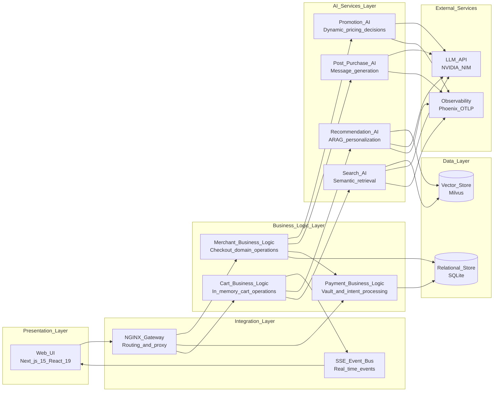

### 2.3 Technology Architecture View

Maps technology components to infrastructure.

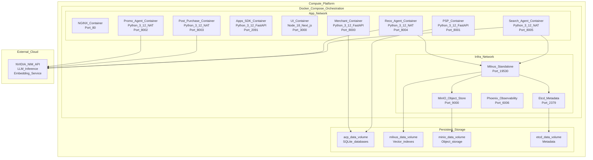

### 2.4 Data Architecture View

```mermaid
graph TB
    subgraph Data_Domains
        subgraph Product_Domain
            ProductCatalog[Product_Catalog<br>4_products_with_pricing<br>lifecycle_demand_data]
            CompetitorPrices[Competitor_Prices<br>Price_comparison<br>from_other_retailers]
            ProductEmbeddings[Product_Embeddings<br>Vector_representations<br>for_semantic_search]
        end

        subgraph Customer_Domain
            CustomerRecords[Customer_Records<br>Email_name<br>identity]
            BrowsingHistory[Browsing_History<br>Category_views<br>search_terms]
        end

        subgraph Commerce_Domain
            CheckoutSessions[Checkout_Sessions<br>Session_lifecycle<br>items_totals_status]
            VaultTokens[Vault_Tokens<br>Tokenized_payment<br>methods]
            PaymentIntents[Payment_Intents<br>Charge_processing<br>records]
        end

        subgraph Analytics_Domain
            AgentOutcomes[Agent_Invocation_Outcomes<br>Success_rates_latency<br>error_tracking]
            AttributionEvents[Recommendation_Attribution<br>Impressions_clicks<br>purchases]
        end

        subgraph Transient_Data
            CartState[Cart_State<br>In_memory<br>session_scoped]
            SSEEvents[SSE_Event_History<br>In_memory<br>clearable]
            IdempotencyCache[Idempotency_Cache<br>In_memory<br>24h_TTL]
        end
    end

    subgraph Storage_Systems
        SQLiteDB[(SQLite<br>Relational)]
        MilvusDB[(Milvus<br>Vector)]
        Memory[(Process_Memory<br>Ephemeral)]
    end

    ProductCatalog --> SQLiteDB
    CompetitorPrices --> SQLiteDB
    CustomerRecords --> SQLiteDB
    BrowsingHistory --> SQLiteDB
    CheckoutSessions --> SQLiteDB
    VaultTokens --> SQLiteDB
    PaymentIntents --> SQLiteDB
    AgentOutcomes --> SQLiteDB
    AttributionEvents --> SQLiteDB
    ProductEmbeddings --> MilvusDB
    CartState --> Memory
    SSEEvents --> Memory
    IdempotencyCache --> Memory
```

---

## 3. Integration Diagrams

### 3.1 End-to-End Checkout Sequence (ACP Protocol)

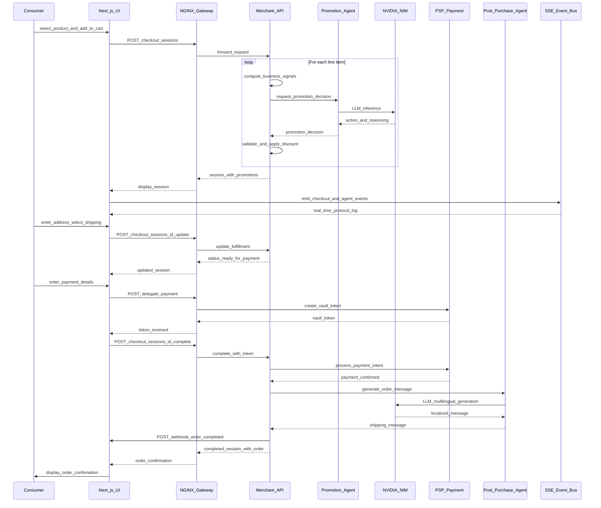

### 3.2 Recommendation Flow Sequence

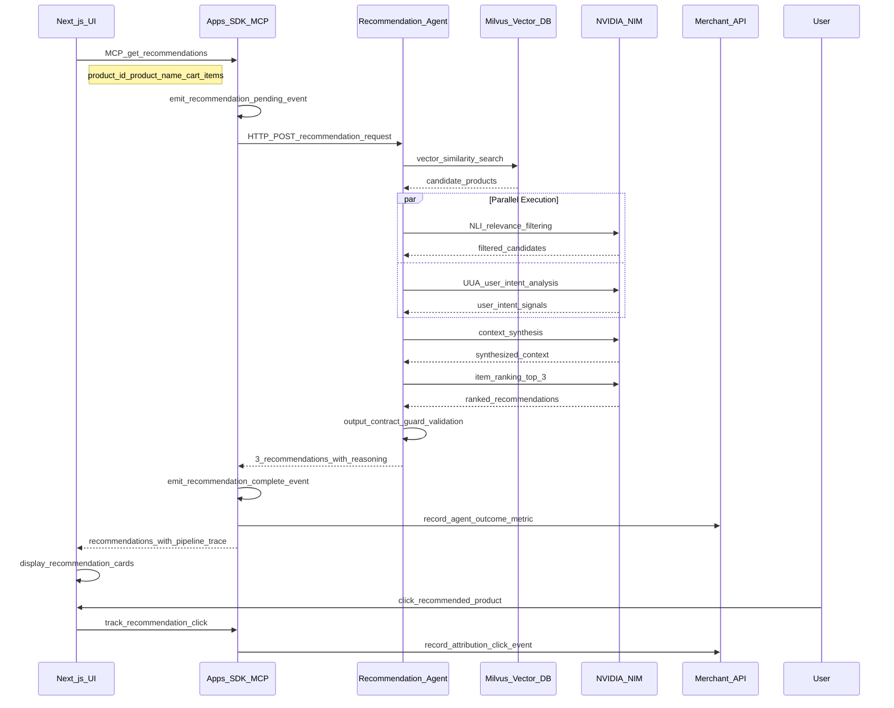

### 3.3 UCP Discovery and A2A Flow

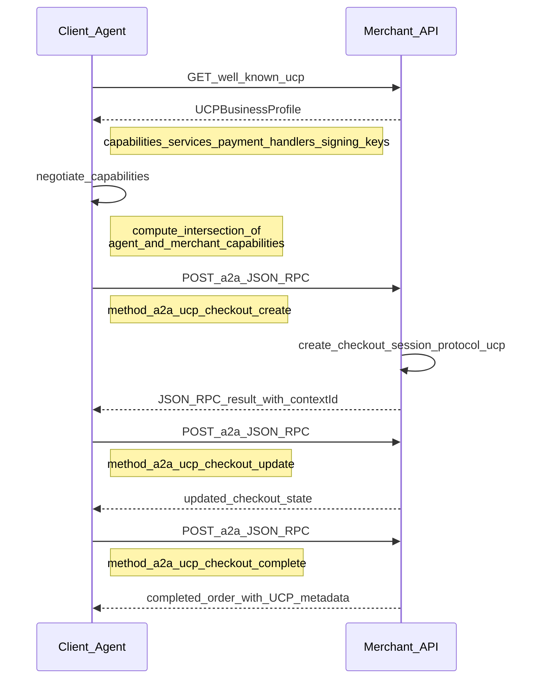

---

## 4. Logical Architecture Diagram (TOGAF)

### 4.1 Logical Component Model

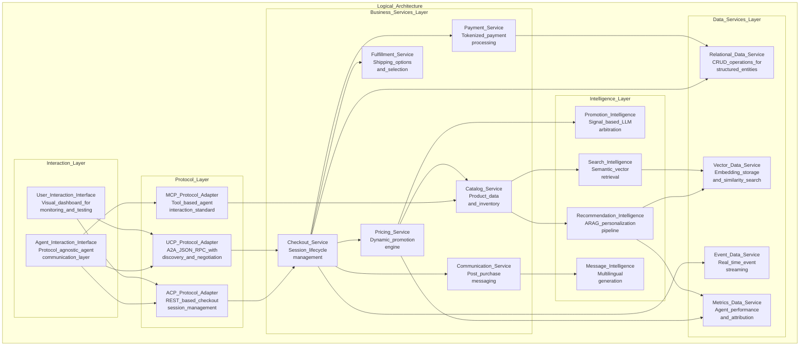

### 4.2 Cross-Cutting Concerns

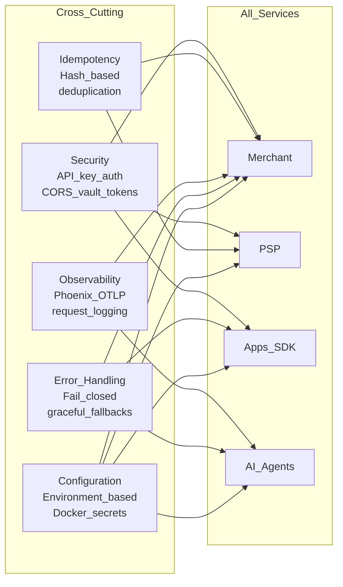
