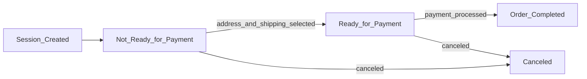
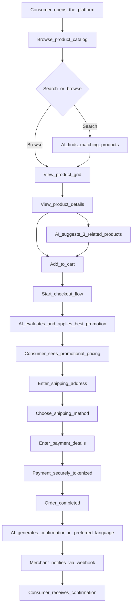
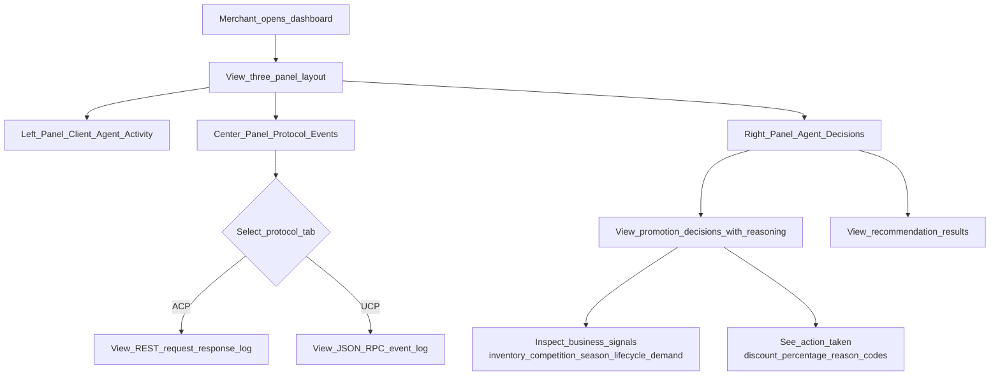
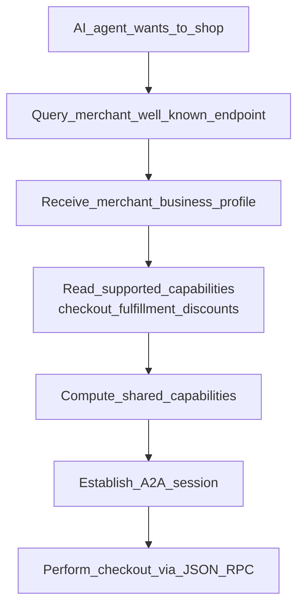
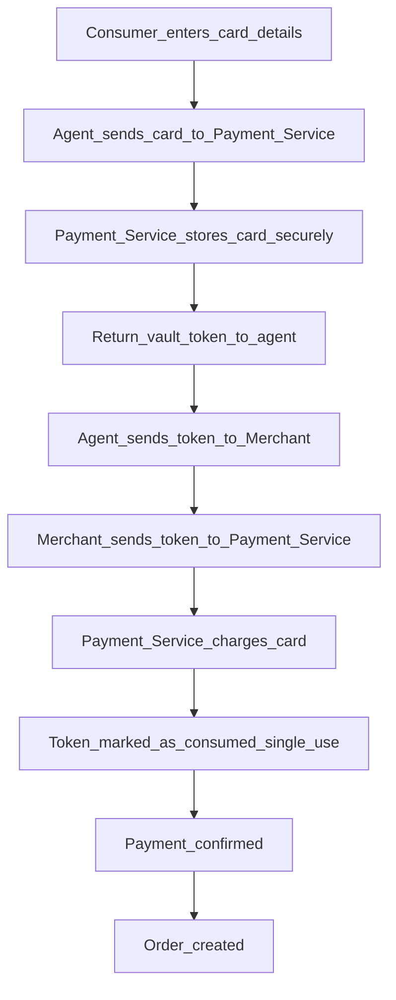

# Functional Documentation

This document describes the business logic, user journeys, and workflows of the Retail Agentic Commerce platform in plain language suitable for non-technical stakeholders.

---

## 1. What This System Does

The Retail Agentic Commerce platform demonstrates how **AI agents can shop on behalf of consumers**. Instead of a person browsing a website, clicking "Add to Cart," and typing in their credit card, an AI agent performs these steps programmatically using standardized protocols.

The platform simulates a complete shopping experience:
1. A consumer (or their AI agent) **discovers products** through search or recommendations
2. The merchant's AI **automatically applies the best available promotion** based on inventory, competition, and market conditions
3. The consumer selects a **shipping method** and provides a **delivery address**
4. **Payment is securely processed** through tokenized delegation
5. A **personalized confirmation message** is generated in the consumer's preferred language
6. The merchant **notifies the consumer** via webhook when the order is complete

---

## 2. Key Business Concepts

### 2.1 What is an "Agentic Commerce Protocol" (ACP)?

ACP is a standardized way for AI agents to communicate with online stores. Think of it like a common language that all AI shopping assistants and all merchants understand. When you use ACP:

- The agent says "I want to buy these items" using a standard message format
- The merchant responds with prices, available shipping options, and any discounts
- The agent can complete the purchase on behalf of the consumer

**Why this matters**: Without a standard protocol, every AI agent would need custom code for every merchant, similar to how early web browsers needed different plugins for every website.

### 2.2 What is the "Universal Commerce Protocol" (UCP)?

UCP is an enhanced version of ACP that adds:
- **Discovery**: An agent can visit a merchant's website and automatically learn what services are available
- **Capability negotiation**: The agent and merchant agree on what features they both support
- **A2A (Agent-to-Agent)**: Communication happens via a structured message format (JSON-RPC), enabling richer interactions

### 2.3 What is a "Checkout Session"?

A checkout session represents a single shopping transaction from start to finish. It tracks:
- Which products the consumer wants to buy
- What promotions were applied
- The selected shipping method
- Payment status
- Order completion

A session flows through these states:

### 2.4 What is "Payment Delegation"?

Payment delegation is a security pattern where:
1. The consumer's agent sends credit card details to a **payment service** (not the merchant)
2. The payment service stores the card securely and returns a **token** (an opaque reference)
3. The agent sends only the token to the merchant
4. The merchant uses the token to charge the card through the payment service

**Why this matters**: The merchant never sees actual credit card numbers, reducing fraud risk and compliance burden.

---

## 3. The Four AI Agents

The system uses four specialized AI agents, each responsible for a specific business function.

### 3.1 Promotion Agent — "The Pricing Strategist"

**What it does**: Decides whether to offer a discount on each product and how large the discount should be.

**How it decides**: The agent considers five business signals:

| Signal | What It Measures | Example |
|--------|-----------------|---------|
| **Inventory Pressure** | How much stock is on hand | High stock (100+ units) means pressure to sell |
| **Competition Position** | Price vs. competitor prices | If our price is higher, a discount may be needed |
| **Seasonal Urgency** | Proximity to retail events (Black Friday, etc.) | Peak season drives more aggressive pricing |
| **Product Lifecycle** | Product maturity stage | Clearance items get bigger discounts; new arrivals get less |
| **Demand Velocity** | Whether demand is growing or shrinking | Decelerating demand suggests a discount is needed |

**Available actions**:
- No promotion (maintain full price)
- 5% discount
- 10% discount
- 15% discount
- Free shipping (waive shipping fee)

**Safety guardrail**: The agent can only choose actions that maintain the merchant's minimum profit margin. For example, if a product has a 15% minimum margin, the agent cannot offer a 15% discount because that would eliminate the entire margin.

### 3.2 Recommendation Agent — "The Personal Shopper"

**What it does**: Suggests three complementary products based on what the consumer is currently viewing and what is in their cart.

**How it works** (simplified):
1. **Find similar products**: Search the product catalog for items related to the current product
2. **Filter relevance**: An AI evaluates whether each candidate is truly relevant
3. **Understand intent**: A separate AI analyzes what the consumer is likely looking for
4. **Rank and select**: Combines relevance and intent understanding to pick the top three recommendations
5. **Explain choices**: Each recommendation includes a brief explanation of why it was suggested

### 3.3 Search Agent — "The Catalog Navigator"

**What it does**: Finds products that match a natural language query (e.g., "casual t-shirts under $30").

**How it works**: Converts the search query into a mathematical representation (embedding) and finds products with similar representations in the vector database.

### 3.4 Post-Purchase Agent — "The Communication Manager"

**What it does**: Generates personalized order status messages in the consumer's preferred language.

**Supported languages**: English, Spanish, French

**Message types**:
- Order confirmed
- Order shipped
- Out for delivery
- Delivered

---

## 4. User Journeys

### 4.1 Journey: Complete Purchase with AI Agent

### 4.2 Journey: Merchant Monitors Agent Activity

### 4.3 Journey: UCP Agent Discovery

---

## 5. Business Logic Deep Dives

### 5.1 How Dynamic Pricing Works

The promotion engine follows a strict decision process designed to maximize sales while protecting profit margins.

**Step 1 — Gather Market Intelligence**

For each product in the cart, the system automatically computes:
- **Stock availability**: Products with over 50 units in stock have "high inventory pressure"
- **Competitive pricing**: Compares the product's price against known competitor prices
- **Seasonal context**: Checks if any major retail events (e.g., Black Friday, Summer Sale) are within 3 days
- **Product stage**: Is this a new arrival, growing product, mature item, or clearance?
- **Demand trend**: Is demand accelerating, flat, or slowing down?

**Step 2 — Define Safe Action Space**

The system calculates which discounts are financially safe:
- A product with a 15% minimum margin and a $25 base price cannot be discounted more than 15% (or the margin disappears)
- Only discount levels that maintain the minimum margin are presented to the AI agent

**Step 3 — AI Makes the Decision**

The Promotion Agent evaluates the signals and selects the best action. Its decision logic follows this general pattern:

| Condition | Typical Action |
|-----------|---------------|
| Low inventory, competitive price | No promotion needed |
| High inventory, price above competitors | 10% discount to compete |
| High inventory, peak season | Aggressive discount (15% or more) |
| New arrival, any condition | Conservative (free shipping at most) |
| Clearance item, decelerating demand | Maximum safe discount |

**Step 4 — Apply and Validate**

The discount is applied to the line item price, and the system recalculates all totals (subtotal, tax, total). If the AI returns an unexpected action, the system safely defaults to no discount.

### 5.2 How Recommendations Work

The recommendation engine uses a multi-stage pipeline:

| Stage | What Happens | Why |
|-------|--------------|-----|
| **Vector Search** | Find 10-20 products similar to the current one | Cast a wide net of candidates |
| **Relevance Filtering** | AI assesses if each candidate is truly relevant | Remove false positives from vector similarity |
| **Intent Analysis** | AI interprets what the consumer is looking for | Understand context beyond just product similarity |
| **Context Synthesis** | Combine filtering results with intent analysis | Build a complete picture |
| **Ranking** | AI selects and ranks the top 3 products | Present the most relevant recommendations |
| **Validation** | Verify the output matches the expected format | Ensure reliability |

Each recommendation includes:
- Product name and ID
- Rank (1 to 3)
- A natural language explanation of why it was recommended

### 5.3 How Payment Processing Works

Key protections:
- **Card details never reach the merchant** — only the payment service sees them
- **Tokens are single-use** — they cannot be reused after the payment is processed
- **Amount limits** — each token has an allowance tied to a specific checkout session and amount
- **Idempotency** — duplicate payment requests return the same result without charging twice

### 5.4 How Post-Purchase Messages Work

After an order is completed:
1. The merchant sends the order details and consumer's language preference to the Post-Purchase Agent
2. The agent generates a personalized message using the appropriate language and tone
3. The message is included in the order confirmation webhook
4. The UI displays the message in the Agent Activity panel

**Message personalization factors**:
- Brand persona (company name, tone: friendly/professional/casual/urgent)
- Preferred language (English, Spanish, French)
- Order details (items, tracking URL, estimated delivery)
- Order status (confirmed, shipped, out for delivery, delivered)

### 5.5 Cart Management

The shopping cart supports standard operations:

| Operation | What Happens | Business Rule |
|-----------|--------------|---------------|
| **Add to Cart** | Product added with quantity | Fetches current price and stock from catalog |
| **Remove from Cart** | Product removed entirely | Cart totals recalculated |
| **Update Quantity** | Quantity changed | Quantity of 0 removes the item |
| **Get Cart** | View current cart state | Returns all items, subtotal, shipping, tax, total |

**Price Calculation**:
- Subtotal = sum of (price x quantity) for all items
- Shipping = flat rate $5.00
- Tax = 8.75% of subtotal
- Total = subtotal + shipping + tax

---

## 6. Webhook Integration

When an order is completed, the merchant sends a webhook notification to the consumer's system (the UI).

**Webhook Payload**:
| Field | Description |
|-------|-------------|
| Event type | `order.completed` |
| Order ID | Unique order identifier |
| Session ID | Checkout session that produced this order |
| Items | Ordered products with quantities and prices |
| Totals | Final amounts (subtotal, tax, shipping, total) |
| Message | AI-generated post-purchase message |
| Timestamp | When the order was completed |

**Webhook Security**:
- Signed with a shared secret (HMAC)
- UCP webhooks use EC P-256 (ES256) JWK signing for enhanced security

---

## 7. Three-Panel Dashboard

The UI presents a real-time three-panel dashboard:

| Panel | Position | Content | Audience |
|-------|----------|---------|----------|
| **Client Agent** | Left | Product grid, search bar, checkout modal, payment form | Simulates the consumer's AI agent |
| **Merchant Server** | Center | Protocol event log (ACP or UCP tab), session state transitions | Shows what the merchant sees |
| **Agent Activity** | Right | Promotion decisions with reasoning, recommendation results | Shows AI agent decision-making |

```mermaid
flowchart LR
    subgraph Left_Panel
        Products[Product_Grid]
        Search[Search_Bar]
        Cart[Shopping_Cart]
        Checkout[Checkout_Modal]
    end

    subgraph Center_Panel
        ACPLog[ACP_Protocol_Events]
        UCPLog[UCP_Protocol_Events]
        SessionState[Session_Lifecycle_State]
    end

    subgraph Right_Panel
        PromoDecisions[Promotion_Decisions<br>with_business_signals]
        RecoResults[Recommendation_Results<br>with_reasoning]
        WebhookEvents[Post_Purchase<br>Webhook_Events]
    end

    Left_Panel -->|triggers| Center_Panel
    Center_Panel -->|feeds| Right_Panel
```

---

## 8. Product Catalog

The reference implementation includes four sample products:

| Product | Price | Stock | Stage | Demand |
|---------|-------|-------|-------|--------|
| Classic Tee | $25.00 | 100 units | Mature | Flat |
| V-Neck Tee | $28.00 | 50 units | Mature | Decelerating |
| Graphic Tee | $32.00 | 200 units | Growth | Accelerating |
| Premium Tee | $45.00 | 25 units | New Arrival | Accelerating |

Each product has:
- Unique product ID and SKU
- Category and subcategory classification
- Detailed text description
- Size and variant attributes
- Image URL for visual display
- Competitor price data for market comparison
- Minimum profit margin (typically 15%)

---

## 9. Metrics and Analytics

The system tracks two categories of metrics:

### 9.1 Agent Invocation Outcomes

Every time an AI agent is called, the result is recorded:
- **Agent type**: promotion, recommendation, search, post-purchase
- **Channel**: ACP, UCP, or Apps SDK
- **Status**: success, fallback success, timeout error, upstream error, validation error, internal error
- **Latency**: How long the agent call took (milliseconds)

### 9.2 Recommendation Attribution

Tracks the funnel from recommendation to purchase:
- **Impression**: A recommendation was shown to the consumer
- **Click**: The consumer clicked on a recommended product
- **Purchase**: The consumer purchased a recommended product

This data enables measuring the business impact of recommendation AI.
