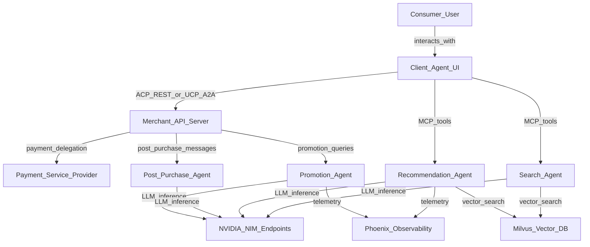
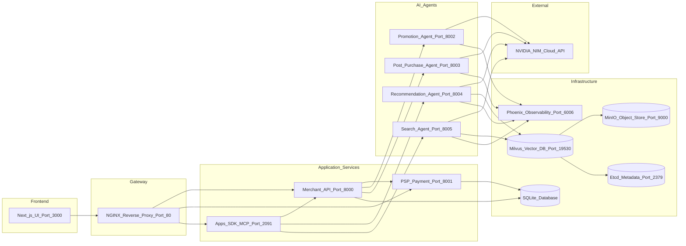
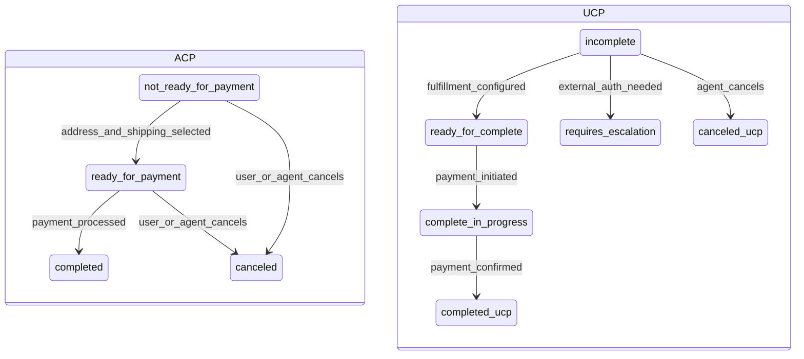
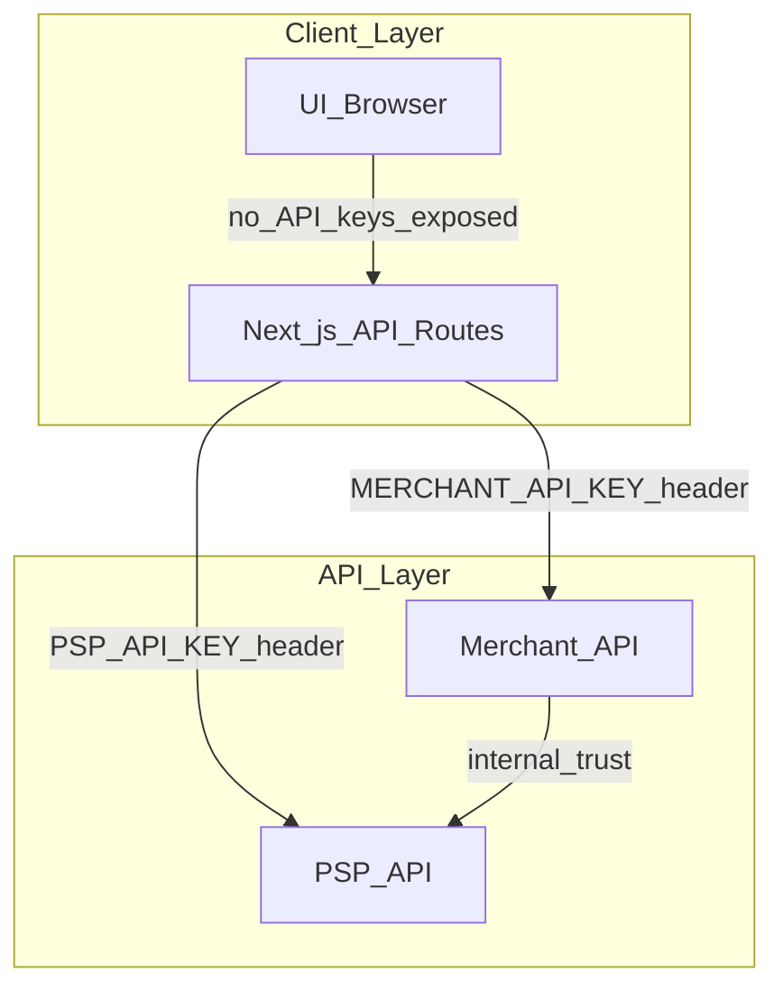

# High-Level Design (HLD)

## 1. Executive Summary

The Retail Agentic Commerce platform is a reference implementation of the **Agentic Commerce Protocol (ACP)** and **Universal Commerce Protocol (UCP)**. It demonstrates how autonomous AI agents can discover merchants, browse catalogs, negotiate promotions, and complete purchases on behalf of consumers through standardized, machine-readable protocols.

The system is designed as a modular, event-driven microservices architecture with clear separation between the client agent interface, merchant business logic, payment processing, and AI agent orchestration.

### Key Business Objectives

| Objective | How the System Achieves It |
|-----------|---------------------------|
| **AI-driven commerce** | Four specialized agents (Promotion, Recommendation, Search, Post-Purchase) execute business strategies autonomously |
| **Protocol standardization** | ACP (REST) and UCP (A2A JSON-RPC) enable interoperable agent-to-merchant communication |
| **Dynamic pricing** | Three-layer hybrid architecture combines deterministic business rules with LLM-based arbitration |
| **Observability** | Full protocol logging, agent decision tracing, and LLM observability via Phoenix/OpenTelemetry |
| **Developer experience** | One-command setup, Docker deployment, and comprehensive API documentation |

---

## 2. System Context

### 2.1 Actors and External Systems

### 2.2 Core Capabilities

| Capability | Protocol | Description |
|------------|----------|-------------|
| **Checkout Session Management** | ACP, UCP | Create, update, complete, and cancel checkout sessions |
| **Dynamic Promotion Engine** | ACP | Three-layer pricing: deterministic signals, LLM arbitration, deterministic execution |
| **Personalized Recommendations** | Apps SDK (MCP) | ARAG pipeline with vector retrieval, NLI filtering, and LLM ranking |
| **Semantic Product Search** | Apps SDK (MCP) | Vector-based product discovery with category filtering |
| **Post-Purchase Communication** | ACP | Multilingual shipping and order status messages |
| **Payment Delegation** | ACP, UCP | Tokenized card payment via vault tokens |
| **Webhook Notifications** | ACP | Real-time order completion events to client systems |
| **Agent Discovery** | UCP | Well-known endpoint for capability and service discovery |

---

## 3. Architectural Principles

| Principle | Application |
|-----------|-------------|
| **Protocol-first** | Business logic is protocol-agnostic; ACP and UCP adapters share the same domain layer |
| **Fail-closed safety** | Promotion decisions that violate margin constraints are rejected; fallback is always "no discount" |
| **Deterministic boundaries** | LLMs make recommendations within pre-computed, margin-safe action spaces |
| **Stateless agents** | All NAT agents are stateless HTTP services; state lives in the merchant database |
| **Event-driven UI** | Server-Sent Events (SSE) stream protocol and agent activity to the frontend in real time |
| **Idempotent operations** | All mutating endpoints support idempotency keys to prevent duplicate processing |

---

## 4. Deployment Topology

### 4.1 Service Map

### 4.2 Network Topology

| Network | Services | Purpose |
|---------|----------|---------|
| `acp-network` | All application services (merchant, psp, apps-sdk, ui, nginx, agents) | Inter-service communication |
| `acp-infra-network` | Milvus, MinIO, Etcd, Phoenix | Infrastructure backbone |

### 4.3 Port Allocation

| Port | Service | Access |
|------|---------|--------|
| 80 | NGINX reverse proxy | Public entry point |
| 3000 | Next.js UI | Via NGINX |
| 8000 | Merchant API | Via NGINX and internal |
| 8001 | PSP Payment API | Via NGINX and internal |
| 2091 | Apps SDK MCP Server | Via NGINX and internal |
| 8002 | Promotion Agent | Internal only |
| 8003 | Post-Purchase Agent | Internal only |
| 8004 | Recommendation Agent | Internal only |
| 8005 | Search Agent | Internal only |
| 19530 | Milvus Vector DB | Internal only |
| 9000 | MinIO Object Storage | Internal only |
| 2379 | Etcd Metadata Store | Internal only |
| 6006 | Phoenix Observability | Dashboard access |

---

## 5. Technology Stack

| Layer | Technology | Version | Purpose |
|-------|-----------|---------|---------|
| **Frontend** | Next.js | 15+ | Server-side rendering, API routes |
| **Frontend** | React | 19 | UI component framework |
| **Frontend** | Tailwind CSS | 3+ | Utility-first styling |
| **Frontend** | Kaizen UI | — | NVIDIA design system components |
| **Backend** | Python | 3.12+ | Runtime for all backend services |
| **Backend** | FastAPI | Latest | Async HTTP framework |
| **Backend** | SQLModel | Latest | ORM with Pydantic integration |
| **Backend** | SQLAlchemy | Latest | Database engine |
| **Database** | SQLite | 3 | Relational data store |
| **Vector DB** | Milvus | Standalone | Semantic similarity search |
| **AI Runtime** | NVIDIA NIM | Cloud/Local | LLM inference (Nemotron-3-nano-30b) |
| **AI Runtime** | NeMo Agent Toolkit (NAT) | Latest | Agent orchestration framework |
| **Embeddings** | nv-embedqa-e5-v5 | Latest | Text-to-vector embedding model |
| **Observability** | Phoenix (Arize) | Latest | LLM trace visualization |
| **Observability** | OpenTelemetry | Latest | Distributed tracing standard |
| **Gateway** | NGINX | Latest | Reverse proxy and load balancing |
| **Containers** | Docker Compose | Latest | Service orchestration |
| **Package Mgmt** | uv (Python) | Latest | Fast Python dependency management |
| **Package Mgmt** | pnpm (Node) | Latest | Node.js package management |

---

## 6. Data Flow Overview

### 6.1 Checkout Session Lifecycle

### 6.2 Information Flow Summary

| Flow | Source | Destination | Protocol | Data |
|------|--------|-------------|----------|------|
| Product browsing | UI | Merchant API | REST | Product catalog queries |
| Session creation | UI | Merchant API | ACP REST or UCP A2A | Cart items, buyer info |
| Promotion decision | Merchant API | Promotion Agent | HTTP (NAT) | Product signals, allowed actions |
| Recommendations | Apps SDK | Recommendation Agent | HTTP (NAT) | Product context, cart state |
| Product search | Apps SDK | Search Agent | HTTP (NAT) | Search query, category filter |
| Payment delegation | UI | PSP | REST | Card details, allowance |
| Payment processing | Merchant API | PSP | REST | Vault token, amount |
| Post-purchase message | Merchant API | Post-Purchase Agent | HTTP (NAT) | Order data, locale |
| Webhook notification | Merchant API | UI webhook endpoint | HTTP POST | Order completion event |
| Agent telemetry | All agents | Phoenix | OTLP | LLM traces, spans |
| Vector search | Recommendation/Search Agent | Milvus | gRPC | Embedding vectors, filters |

---

## 7. Security Architecture

### 7.1 Authentication Model

| Mechanism | Where Applied | Details |
|-----------|--------------|---------|
| **API Key Auth** | Merchant API, PSP API | Bearer token in Authorization header |
| **Server-side proxy** | Next.js API routes | API keys never sent to browser |
| **Idempotency** | All POST endpoints | SHA-256 hash of request body |
| **Webhook signatures** | UCP webhooks | EC P-256 (ES256) JWK signing |
| **CORS** | All APIs | Configurable origin allowlist |

### 7.2 Trust Boundaries

| Boundary | Trust Level | Protection |
|----------|-------------|------------|
| Browser to Next.js | Untrusted | CORS, no API key exposure |
| Next.js to Merchant API | Trusted (server-side) | API key authentication |
| Merchant API to PSP | Trusted (internal network) | API key authentication |
| Merchant API to Agents | Trusted (internal network) | Docker network isolation |
| Agents to NIM | External | NVIDIA API key (TLS) |

---

## 8. Scalability Considerations

| Concern | Current Design | Production Path |
|---------|---------------|-----------------|
| **Database** | SQLite (single file) | Migrate to PostgreSQL with connection pooling |
| **Cart storage** | In-memory dict (Apps SDK) | Redis or database-backed sessions |
| **Idempotency** | In-memory cache | Redis with TTL |
| **Agent scaling** | Single instance per agent | Horizontal scaling behind load balancer |
| **Vector search** | Milvus standalone | Milvus cluster with replicas |
| **LLM inference** | NVIDIA NIM cloud | Local NIM deployment for latency/cost |
| **Observability** | Phoenix standalone | Production APM (Datadog, New Relic) |

---

## 9. Non-Functional Requirements

| Requirement | Target | Implementation |
|-------------|--------|----------------|
| **Availability** | Development-grade | Docker Compose restart policies |
| **Latency (API)** | Sub-200ms for non-agent calls | Async FastAPI, connection pooling |
| **Latency (Agent)** | Sub-3s for promotion decisions | 10s timeout with graceful fallback |
| **Idempotency** | All POST operations | Hash-based deduplication |
| **Observability** | Full agent trace visibility | Phoenix + OpenTelemetry + SSE event streaming |
| **Protocol compliance** | ACP spec v2026-01-16, UCP spec v2026-01-23 | Automated schema validation |
