# Low-Level Design (LLD)

## 1. Component Architecture

This document details the internal design of each service, including data models, API contracts, algorithms, and inter-service communication patterns.

---

## 2. Merchant Service

### 2.1 Module Structure

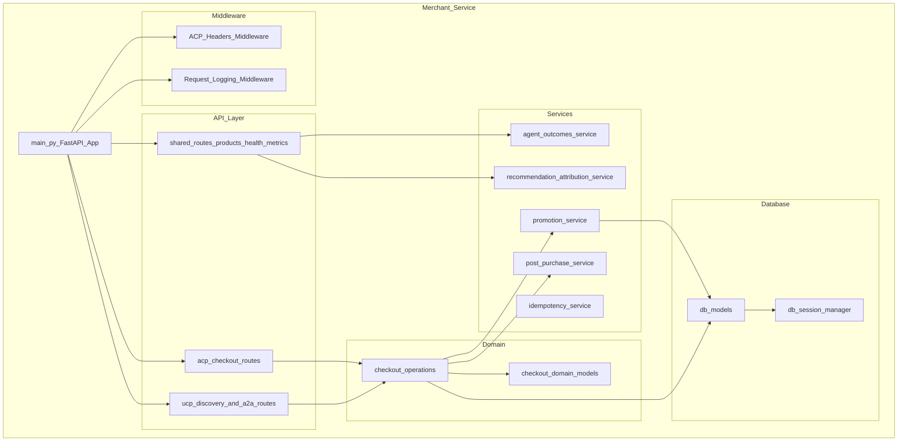

### 2.2 Database Entity Relationship

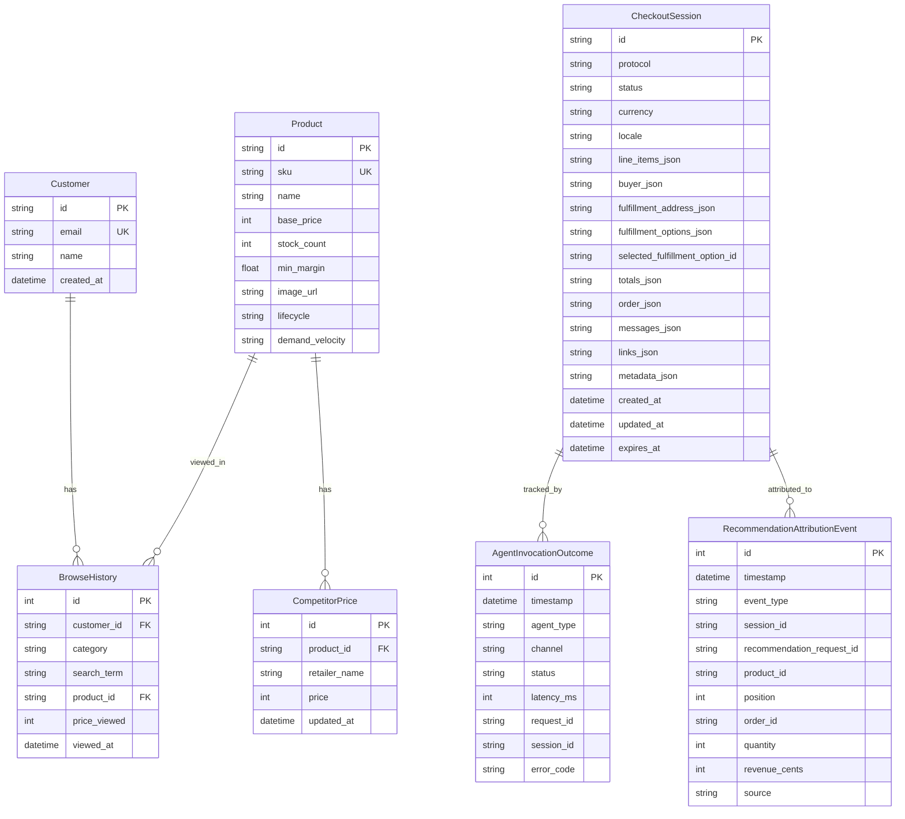

### 2.3 ACP Checkout Route Contract

#### Create Session

| Field | Type | Direction | Description |
|-------|------|-----------|-------------|
| `items` | Array of `{id, quantity}` | Request | Products to purchase |
| `buyer` | Object `{first_name, last_name, email, phone_number}` | Request (optional) | Buyer identity |
| `fulfillment_address` | Object | Request (optional) | Shipping address |
| `metadata` | Object `{discounts: {codes: []}}` | Request (optional) | Discount codes |
| `id` | String | Response | Session identifier (e.g., `checkout_abc123`) |
| `status` | Enum | Response | `not_ready_for_payment` initially |
| `line_items` | Array of LineItem | Response | Items with promotion data applied |
| `fulfillment_options` | Array of FulfillmentOption | Response | Available shipping methods |
| `totals` | Array of Total | Response | Breakdown: subtotal, discount, tax, fulfillment, total |

#### Update Session

| Field | Type | Direction | Description |
|-------|------|-----------|-------------|
| `items` | Array | Request (optional) | Replace cart items |
| `fulfillment_option_id` | String | Request (optional) | Selected shipping method |
| `fulfillment_address` | Object | Request (optional) | Shipping destination |
| `discounts` | Object | Request (optional) | Discount code updates |

Fulfillment address and shipping selection cause status to transition from `not_ready_for_payment` to `ready_for_payment`.

#### Complete Session

| Field | Type | Direction | Description |
|-------|------|-----------|-------------|
| `payment_data` | Object `{token, provider, ...}` | Request | Vault token from PSP delegation |
| `status` | `completed` | Response | Final state |
| `order` | Object `{id, completed_at, message}` | Response | Order confirmation details |

### 2.4 Promotion Service Algorithm

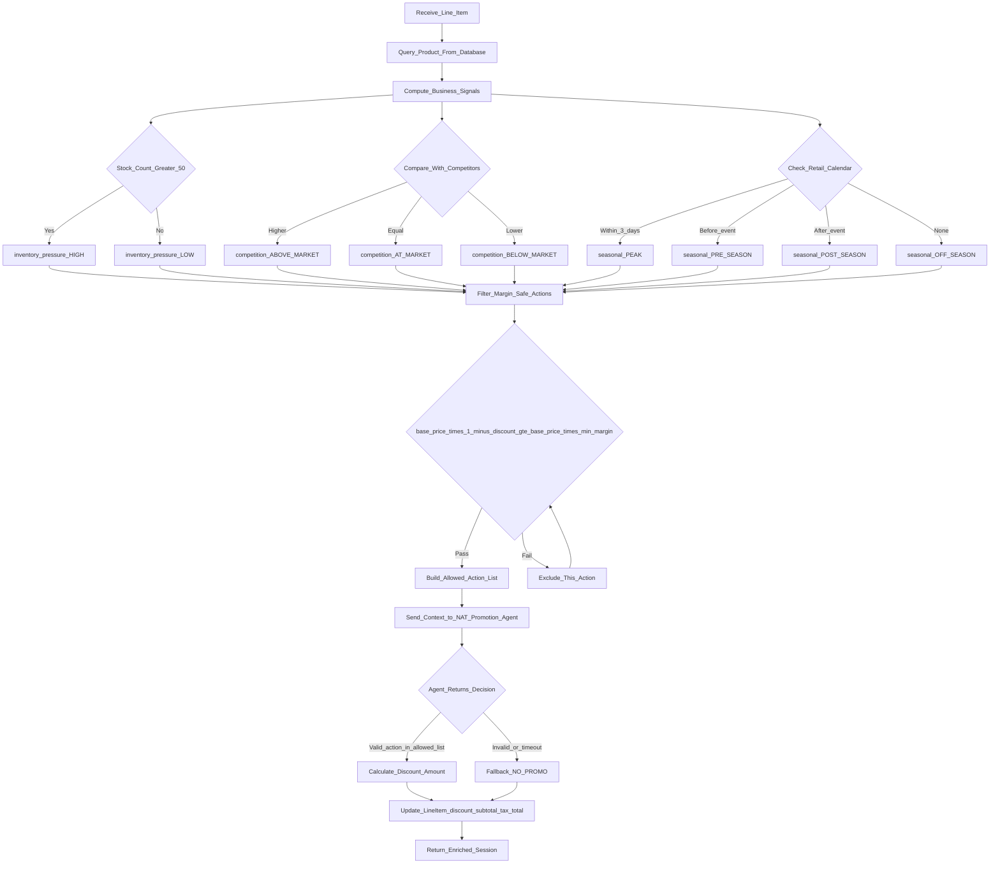

**Discount Map** (action to percentage):

| Action | Discount Rate |
|--------|--------------|
| `NO_PROMO` | 0% |
| `DISCOUNT_5_PCT` | 5% |
| `DISCOUNT_10_PCT` | 10% |
| `DISCOUNT_15_PCT` | 15% |
| `FREE_SHIPPING` | 0% (shipping cost waived) |

### 2.5 Checkout Domain Models

#### LineItem Structure

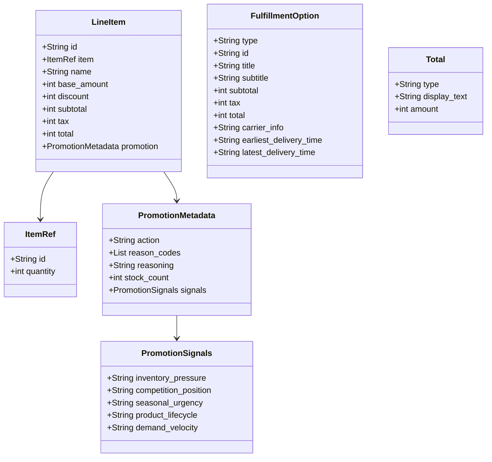

### 2.6 UCP A2A JSON-RPC Methods

| Method | Parameters | Response | Description |
|--------|-----------|----------|-------------|
| `a2a.ucp.checkout.create` | `meta`, `checkout` (items, buyer, address) | `contextId`, `parts` (checkout data, UCP metadata) | Create a new UCP checkout |
| `a2a.ucp.checkout.get` | `meta`, `contextId` | `parts` (current checkout state) | Retrieve UCP session |
| `a2a.ucp.checkout.update` | `meta`, `contextId`, `checkout` | `parts` (updated state) | Update fulfillment, address |
| `a2a.ucp.checkout.complete` | `meta`, `contextId`, `payment_data` | `parts` (completed order) | Process payment and complete |
| `a2a.ucp.checkout.cancel` | `meta`, `contextId` | `parts` (canceled state) | Cancel the session |

### 2.7 UCP Discovery Response Structure

The `/.well-known/ucp` endpoint returns:

| Field | Type | Content |
|-------|------|---------|
| `name` | String | Merchant display name |
| `url` | String | Base URL |
| `description` | String | Business description |
| `capabilities` | Array | Supported UCP capabilities with versions |
| `services` | Array | Offered services (checkout, fulfillment, discounts) |
| `payment_handlers` | Array | Accepted payment methods |
| `signing_keys` | Array | JWK keys for webhook verification |

---

## 3. Payment Service Provider (PSP)

### 3.1 Module Structure

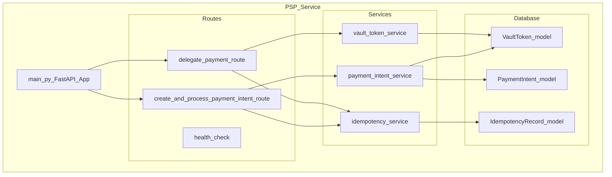

### 3.2 Payment Delegation Flow

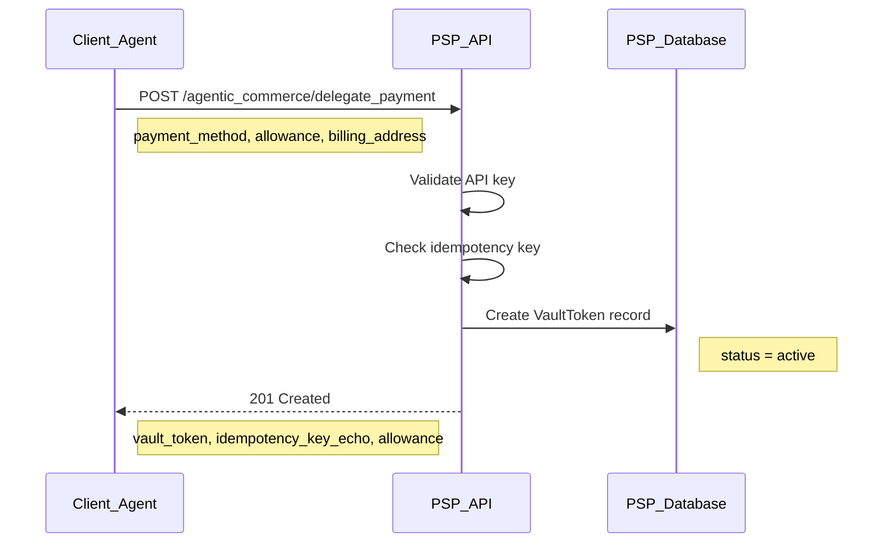

### 3.3 Payment Processing Flow

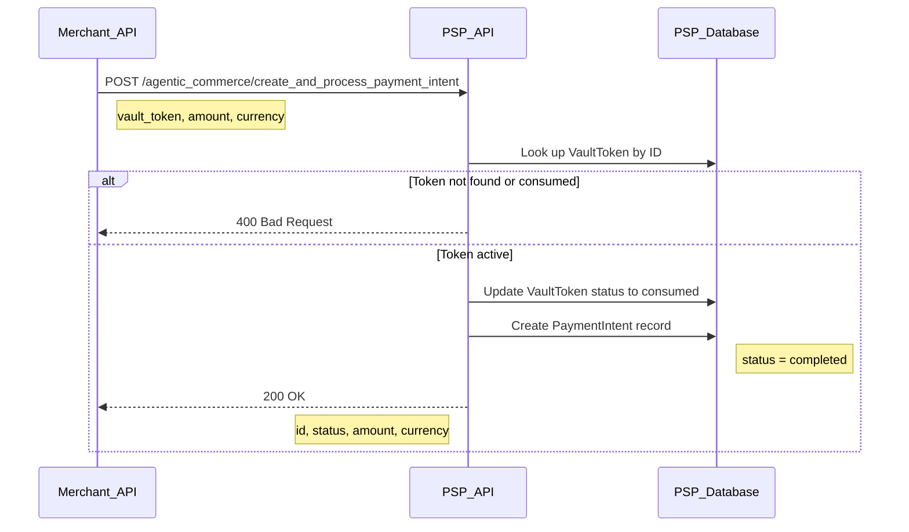

### 3.4 Vault Token States

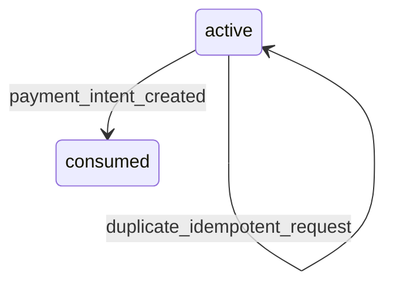

---

## 4. Apps SDK (MCP Server)

### 4.1 MCP Tool Registry

```mermaid
graph TB
    subgraph MCP_Server
        Transport[Stateless_HTTP_Transport]
        subgraph Tools
            SearchProducts[search_products_tool]
            GetReco[get_recommendations_tool]
            AddCart[add_to_cart_tool]
            RemoveCart[remove_from_cart_tool]
            UpdateCart[update_cart_quantity_tool]
            GetCart[get_cart_tool]
            Checkout[checkout_tool]
            TrackClick[track_recommendation_click_tool]
            CreateSession[create_acp_session_tool]
            UpdateSession[update_acp_session_tool]
        end
        subgraph State
            CartStore[in_memory_cart_store]
            EventBus[SSE_event_emitter]
        end
    end

    subgraph External
        MerchantAPI[Merchant_API]
        PSPAPI[PSP_API]
        RecoAgent[Recommendation_Agent]
        SearchAgent[Search_Agent]
    end

    Transport --> Tools
    SearchProducts --> SearchAgent
    GetReco --> RecoAgent
    AddCart --> CartStore
    RemoveCart --> CartStore
    UpdateCart --> CartStore
    GetCart --> CartStore
    Checkout --> MerchantAPI
    Checkout --> PSPAPI
    CreateSession --> MerchantAPI
    UpdateSession --> MerchantAPI
    TrackClick --> MerchantAPI
    Tools --> EventBus
```

### 4.2 Cart Calculation Logic

| Component | Calculation | Example |
|-----------|-------------|---------|
| Subtotal | Sum of (item.basePrice * item.quantity) for all items | 2 shirts at $25.00 = $50.00 |
| Shipping | Flat rate $5.00 | $5.00 |
| Tax | 8.75% of subtotal | $50.00 * 0.0875 = $4.38 |
| Total | subtotal + shipping + tax | $50.00 + $5.00 + $4.38 = $59.38 |

All monetary values are stored and transmitted in **cents** (integer) to avoid floating-point precision issues.

### 4.3 SSE Event Types

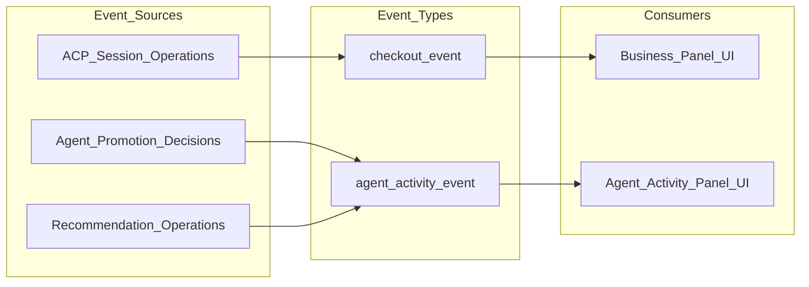

---

## 5. AI Agents (NAT)

### 5.1 Promotion Agent Decision Tree

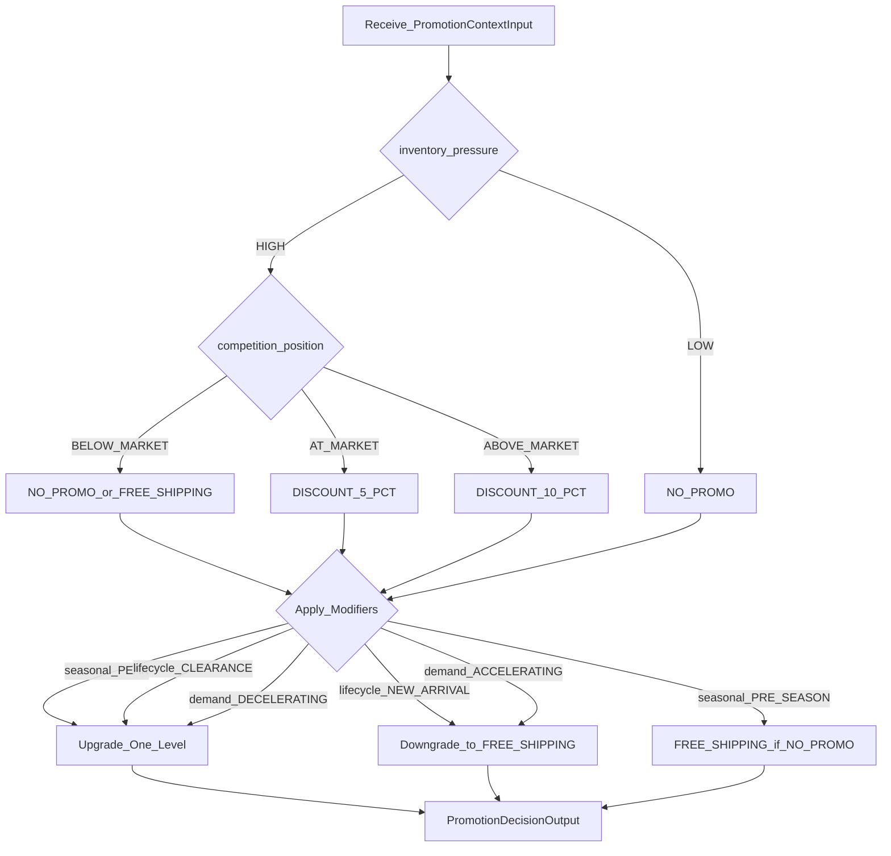

### 5.2 Recommendation Agent ARAG Pipeline

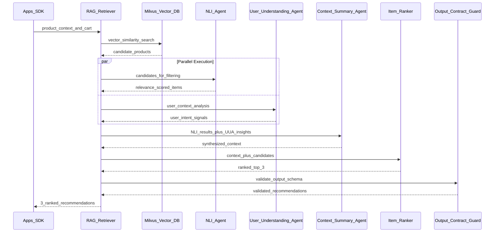

### 5.3 Agent Configuration Summary

| Agent | Model | Temperature | Workflow | Custom Components |
|-------|-------|-------------|----------|-------------------|
| Promotion | nemotron-3-nano-30b | 0.1 | chat_completion | None |
| Post-Purchase | nemotron-3-nano-30b | 0.3 | chat_completion | None |
| Recommendation | nemotron-3-nano-30b | 0.1 | ARAG (multi-step) | parallel_execution, rag_retriever, output_contract_guard |
| Search | nemotron-3-nano-30b | 0.0 | RAG-only | rag_retriever |

---

## 6. Frontend UI

### 6.1 Component Hierarchy

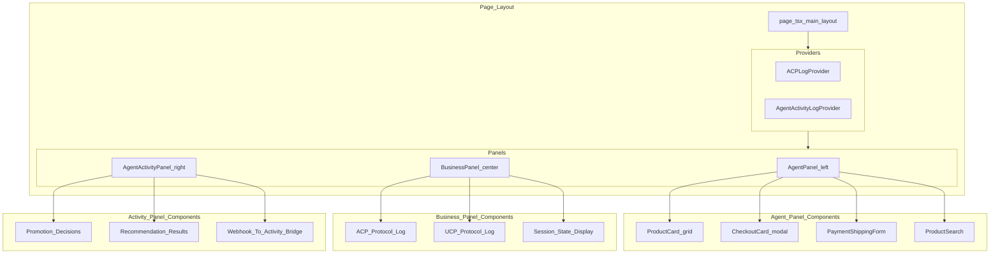

### 6.2 State Management via Hooks

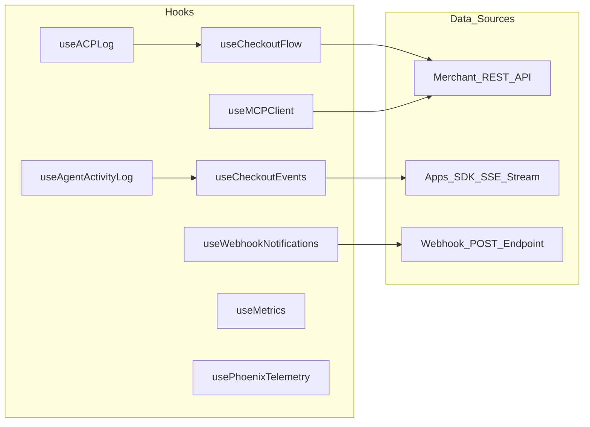

### 6.3 Protocol Adapter Pattern

The frontend supports dual-protocol operation through an adapter pattern in the API client:

| Operation | ACP (REST) | UCP (A2A JSON-RPC) |
|-----------|-----------|---------------------|
| Create session | `POST /checkout_sessions` | `POST /a2a` method: `a2a.ucp.checkout.create` |
| Get session | `GET /checkout_sessions/{id}` | `POST /a2a` method: `a2a.ucp.checkout.get` |
| Update session | `POST /checkout_sessions/{id}` | `POST /a2a` method: `a2a.ucp.checkout.update` |
| Complete session | `POST /checkout_sessions/{id}/complete` | `POST /a2a` method: `a2a.ucp.checkout.complete` |
| Cancel session | `POST /checkout_sessions/{id}/cancel` | `POST /a2a` method: `a2a.ucp.checkout.cancel` |

---

## 7. Middleware Pipeline

### 7.1 Request Processing Order

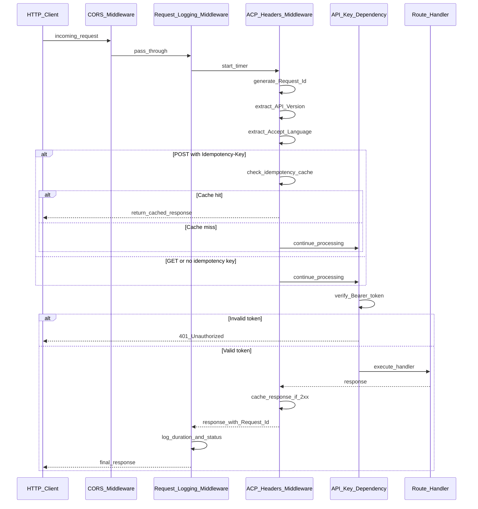

---

## 8. Error Handling Strategy

| Layer | Error Type | Handling | User Impact |
|-------|-----------|----------|-------------|
| **Middleware** | Missing/invalid API key | 401 Unauthorized | Request rejected |
| **Middleware** | Idempotency conflict | 409 Conflict | Retry with new key |
| **Checkout** | Product not found | 404 Not Found | Item removed from session |
| **Promotion** | Agent timeout (10s) | Fallback to NO_PROMO | No discount applied |
| **Promotion** | Invalid action returned | Reject, use NO_PROMO | No discount applied |
| **Promotion** | Margin violation | Reject action | No discount applied |
| **Payment** | Vault token consumed | 400 Bad Request | Re-delegate payment |
| **Payment** | Token not found | 400 Bad Request | Re-delegate payment |
| **Recommendation** | Agent unreachable | Return empty list | No recommendations shown |
| **SSE** | Connection lost | Auto-reconnect (client) | Brief event gap |
| **UCP** | Escalation required | `requires_escalation` status | Redirect to external URL |
